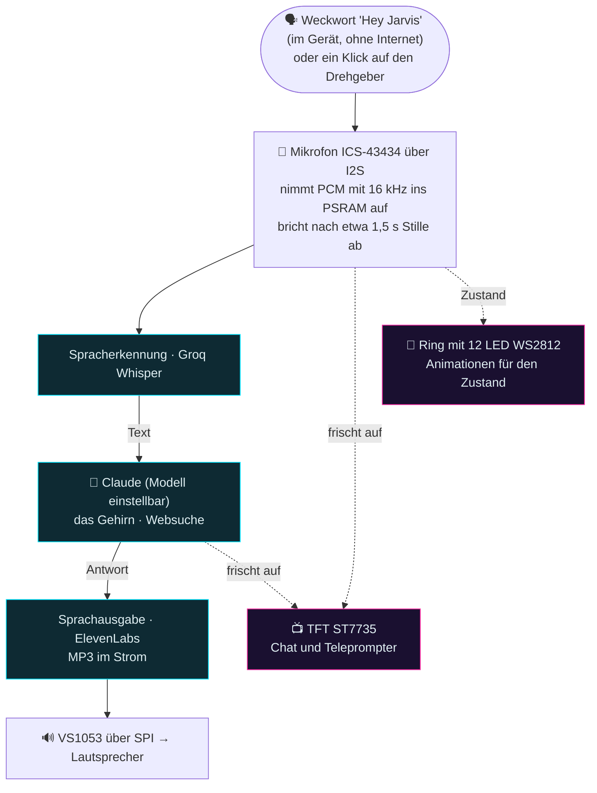

# Alexo — technische Übersicht

Knappe technische Beschreibung der Firmware **Alexo** (Sprachassistent auf dem
ESP32-S3). Die vollständige Anleitung Schritt für Schritt steht in
[`MANUALE.md`](MANUALE.md), das Weckwort in [`WAKEWORD.md`](WAKEWORD.md).

> Dieses Repository ist ein ins Deutsche übersetzter Fork von
> [PeppeMinniti/alexo](https://github.com/PeppeMinniti/alexo). Dokumentation,
> Kommentare, sichtbare Texte und das Laufzeitverhalten sind deutsch. **Bezeichner
> im Code, Dateinamen und Ordnernamen sind italienisch geblieben**, damit ein
> Abgleich mit dem Originalprojekt möglich bleibt. Wer hier arbeitet, findet also
> deutsche Kommentare über Funktionen wie `risposta`, `voce` oder `gobbo`.

## Aufbau (kleines Gerät plus Cloud)

Die Sprachkette ist zweigeteilt: das Weckwort wird **im Gerät** erkannt, ohne
Internet, der Rest sind **HTTPS**-Aufrufe an Dienste in der Cloud.



> **Cyanfarbene** Kästen sind Dienste in der Cloud (über HTTPS), **magentafarbene**
> sind Ausgaben an den Nutzer, die entlang der ganzen Kette aufgefrischt werden. Die
> gestrichelten Pfeile bedeuten "gibt den Zustand wieder" und keine Datenübergabe.

- **Jedes Glied kann ZU HAUSE laufen** statt in der Cloud: trägt man im Panel die
  Adresse eines Servers im eigenen Netz ein, der das OpenAI-Format spricht (LM
  Studio, ein Whisper-Server, eine Sprachausgabe), und antwortet dieser Server, nimmt
  Alexo ihn; sonst geht es von allein zurück in die Cloud. Siehe "KI zu Hause" weiter
  unten.
- **Gehirn**: die Schnittstelle von Anthropic, ab Werk das Modell
  `claude-haiku-4-5` (günstig und schnell; für tragfähigere Antworten lässt sich im
  Web-Panel zur Laufzeit auf `claude-opus-5` wechseln).
- **Spracherkennung**: **Groq** Whisper (kostenlos). **Sprachausgabe**:
  **ElevenLabs** (kann auch nachgebildete Stimmen). Es braucht drei Schlüssel (Groq,
  Anthropic, ElevenLabs); OpenAI ist wahlweise.
- **Auslösung**: das **Weckwort "Hey Jarvis"** im Gerät (microWakeWord mit TFLite
  Micro, vollständig auf dem S3) **oder** ein Klick auf den **Drehgeber**, beides
  parallel. Die Aufnahme endet von allein nach **1,5 s Stille** (Höchstdauer 20 s).
- **Fortlaufender Chat** (`gSettings.chatContinua`, im Panel, ab Werk aus): nach
  einer Antwort öffnet sich das Mikrofon **von allein**, die nächste Frage braucht das
  Weckwort also nicht erneut. Während er wartet, steht der Ring in
  **`ST_FOLLOWUP`** (zwei umlaufende **bernsteinfarbene** Punkte mit **gleichbleibender**
  Helligkeit — nicht die Aussteuerungsanzeige, die ja "ich nehme dich bereits auf"
  bedeutete, und kein Atmen, denn das Abfallen bis fast zur Dunkelheit sah aus, als
  schlösse und öffnete sich der Chat in jedem Zyklus), und auf dem Display steht "du
  dran". Sobald wirklich gesprochen wird, erkannt an derselben nachgeführten Schwelle
  wie beim Abbruch bei Stille über `micVoiceStarted()`, wechselt er nach
  `ST_LISTENING`. Beendet wird er auf drei Wegen: **niemand spricht** innerhalb von
  `CHAT_FOLLOWUP_MS` (3 s; `micSetNoVoiceMs` verkürzt die Wartezeit für genau diese
  eine folgende Aufnahme), ein **Klick** auf den Drehgeber (er beendet die leere
  Aufnahme, was so zählt wie Schweigen: in `gobbo.cpp` gilt der Klick in
  `ST_FOLLOWUP` wie beim Zuhören, sonst startete er einen gerade geschlossenen Chat
  erneut), oder ein Fehler. Das Gedächtnis des Gesprächs gab es schon vorher (acht
  Nachrichten Verlauf in `llm.cpp`): der fortlaufende Chat nimmt nur das Weckwort
  weg und fügt keinen Zusammenhang hinzu. Vor dem erneuten Öffnen des Mikrofons
  laufen **400 ms `micFlush()`** — der Nachhall der eben gesprochenen Antwort kommt
  ins Mikrofon zurück, und ohne das entstünde eine Frage aus dem Nichts.
- **Gesten am Drehgeber**: **Klick** startet und beendet den Chat; **Doppelklick**
  schaltet das Reagieren des Rings auf Geräusche um; **gedrückt und gedreht** regelt
  die Lautstärke; **freies Drehen** blättert. **In der MUSIK** (ST_MUSIC) ändert sich
  der Zweig: **Klick** wechselt zum nächsten Sender, **Doppelklick** verlässt das
  Radio, **Drehen** regelt die Lautstärke. (Der einfache Klick ist um etwa 350 ms
  **verzögert**, um ihn vom Doppelklick zu unterscheiden: die Bibliothek
  Versatile_RotaryEncoder ruft `handlePress` auch beim ersten Klick eines
  Doppelklicks auf, die Unterscheidung steht in `encoder.cpp`.) GPIO14, früher die
  Sprechtaste, treibt die **Hintergrundbeleuchtung des Displays**, die bei Ruhe
  ausgeht.
- **Startbild**: eine Animation auf dem TFT, während der Ring sich "lädt"
  (`bootSplash()` in main.cpp, Schalter `SPLASH_BOOT`).

> **Weckwort**: "Hey Jarvis" ist ein **fertig trainiertes** Modell aus dem Katalog von
> ESPHome. Die Geschichte davor: zuerst "Okay Nabu", das an den Balancing Robot des
> ursprünglichen Autors ging, weil ein Wort in einem Haus nicht zwei Geräte wecken
> kann; danach "Hey Mycroft". Beim Umstellen dieses Forks auf Deutsch kam "Hey Jarvis"
> auf Wunsch des Betreibers. Der ursprüngliche Autor hatte es verworfen, weil es ein
> englisches Modell ist und bei italienischer Aussprache selten ansprach; auf Deutsch
> liegt der Klang näher am Englischen, der Grund entfällt damit weitgehend. Der Test
> am Gerät steht noch aus. Die vollständige Kette in
> [`WAKEWORD.md`](WAKEWORD.md).

## Hardware

| Bauteil | Modell | Aufgabe |
|---|---|---|
| Mikrocontroller | ESP32-S3 **N16R8** (16 MB Flash im QIO-Betrieb, 8 MB PSRAM **octal/OPI**) | — |
| Mikrofon | **ICS-43434** über I2S (in Betrieb, `MIC_USE_I2S=1`) — SCK an 5, WS an 6, SD an 7, L/R an Masse. Das analoge MAX4466 ist die Alternative (`MIC_USE_I2S=0`, GPIO4) | nimmt die Stimme auf |
| Tonausgang | **VS1053 / VS1003** (SPI). Zu beachten: manche Module mit der Aufschrift "VS1053" sind in Wahrheit ein VS**1003** (SCI_STATUS meldet Version 3); für MP3 behandelt die Bibliothek beide gleich. **DREQ auf GPIO18** (von 47 verlegt), **XRST auf GPIO8** (von 38 verlegt, dort sitzt die eingebaute LED) | MP3-Decoder zum Leitungsausgang |
| Verstärker | **PAM8302A**, Klasse D, mono (2,5 W) | verstärkt LOUT und ROUT des VS1053 zum Lautsprecher. SD (Abschaltung, LOW-aktiv) auf **GPIO39**: nur während eines Wortwechsels an, bei Ruhe stumm, damit die Endstufe nicht rauscht |
| Display | **ST7735** TFT 1,8 Zoll 128x160 über SPI | Chat und Teleprompter in Farbe. Am **eigenen SPI-Bus HSPI**, getrennt vom VS1053. **Hintergrundbeleuchtung auf GPIO14**: nach zwei Minuten ohne Bedienung aus, beim ersten Eingriff wieder an |
| LED | Ring **WS2812** mit 12 NeoPixel (5 V) | Animationen für den Zustand |

> Hinweis: ein "Sound Sensor LM358" taugt NICHT für Sprache, er erfasst nur den
> Lautstärkepegel und nicht den Signalverlauf. Es braucht ein echtes Mikrofon, das
> ICS-43434 über I2S oder das analoge MAX4466.

Alle Anschlüsse stehen in [`include/config.h`](include/config.h), der **einzigen
maßgeblichen Stelle**.

## Übersetzen und Aufspielen

Firmware in **C++ mit PlatformIO** (Arduino). Die wichtigsten Befehle:

```bash
# übersetzen
pio run -e esp32-s3-devkitc-1
# Firmware aufspielen (das erste Mal über USB)
pio run -e esp32-s3-devkitc-1 -t upload
# das DATEISYSTEM aufspielen (die Seite des Web-Panels data/index.html nach LittleFS)
# nur nötig, wenn data/ geändert wurde
pio run -e esp32-s3-devkitc-1 -t uploadfs
# serieller Monitor (über USB)
pio run -e esp32-s3-devkitc-1 -t monitor
```

- **Das erste Aufspielen über USB**; danach sind, wenn gewünscht,
  **Aktualisierungen über WLAN** möglich (`platformio.ini` mit
  `upload_protocol = espota` und `upload_port = alexo.local`). Währenddessen zeigt das
  Display eine eigene Anzeige mit dem Prozentwert.
- Unter Windows, wenn `pio` nicht im Suchpfad liegt, den vollen Pfad angeben.

**Protokoll über das Netz (Telnet)**: um die Ausgabe ohne USB-Kabel zu lesen, bietet
die Firmware ein **Telnet-Protokoll auf Port 23** an
([`src/netlog.cpp`](src/netlog.cpp)): `telnet alexo.local` (oder PuTTY im Modus
Raw/Telnet). Es blockiert nicht und stört die Aktualisierung über Funk nicht. Darüber
läuft die Ausgabe von `micDiag()`; `netlogPrintln()` lässt sich für weitere Ausgaben
wiederverwenden.

### ⚠️ Eine Einstellung, die bleiben muss
Die Platine `esp32-s3-devkitc-1` ist mit **8 MB** hinterlegt. Ohne diese Zeilen in
`platformio.ini` wird der Bootloader als 8-MB-Fassung geschrieben, und die eigene
Partitionstabelle, die bis etwa 16 MB reicht, führt in eine **endlose Startschleife**:

```ini
board_upload.flash_size  = 16MB          ; behebt die Startschleife
board_upload.maximum_size = 16777216
board_build.arduino.memory_type = qio_opi ; schaltet den Octal-PSRAM ein, sonst 0 Byte
```

Woran man es merkt: seriell erscheinen nur wiederholte Meldungen aus dem ROM und
`rst:0x3 (RTC_SW_SYS_RST)`, aber keine Ausgabe des Programms.

## Aufbau der Dateien

```
include/
  config.h           # alle Anschlüsse und Hardware-Werte (samt WAKE_*, REC_*, MIC_DIAG, TFL_SELFTEST) und die Werkseinstellungen des Web-Panels
  mic.h net.h stt.h llm.h tts.h ui.h sound.h netlog.h wakeword.h tfltest.h music.h
  encoder.h gobbo.h volume.h
  localai.h          # KI-Dienste zu Hause: Erreichbarkeit und Modellname (siehe unten)
  settings.h webui.h # das Einstellungs-Panel (Werte zur Laufzeit im NVS)
  secrets.example.h  # Vorlage -> nach secrets.h kopieren (von git ignoriert)
src/
  main.cpp           # der Ablauf (Loop auf Kern 1): zuhören, denken, sprechen. runConversation ist eine Frage oder mehrere hintereinander (fortlaufender Chat). Dazu matchAnyTerm für die zweite Stimme, customReplyMatch für die eigene Antwort, isAllucinazione gegen Geisterphrasen und das Überspringen, wenn micHeardVoice false meldet
  mic.cpp            # Mikrofon über I2S: Aufnahme mit NACHGEFÜHRTEM Abbruch bei Stille (über RMS), Pegel für den Ring, micReadChunk und micFlush für das Weckwort, micGetLive und micHeardVoice
  net.cpp            # WLAN-Verbindung (Zugangsdaten aus secrets.h), NTP-Uhr (timeBegin, Zeitzone Europe/Berlin) und nowContextString für Claude
  stt.cpp            # schickt das WAV als multipart an Whisper (Groq oder den Server zu Hause) und liefert Text
  llm.cpp            # zwei Wege: die Messages API von Anthropic samt Websuche oder ein OpenAI-kompatibler Server zu Hause. Modell und Prompt aus gSettings, dazu Datum und Uhrzeit aus dem NTP im System-Prompt. ripuliMarkdown räumt die Antwort auf (die Modelle verwenden Markdown, auch wenn der Prompt es verbietet), damit auf dem Bildschirm und in der Stimme derselbe Text steht
  tts.cpp            # Stimme -> stückweise an den VS1053: ElevenLabs (MP3) oder ein Server zu Hause (WAV). normalizzaPerVoce liest Grad, Prozent, Brüche, Währungen, UHRZEITEN (leggiOrario), TAUSENDER (leggiMigliaia), DATEN (leggiData), abgekürzte EINHEITEN (leggiUnita, Tabelle UNITA erweiterbar) und ORDNUNGSZAHLEN in Buchstaben (leggiOrdinale/ordinaleParola) vor und wirft das Markdown hinaus
  localai.cpp        # KI-Dienste ZU HAUSE: antwortet der PC? welches Modell hat er geladen? (mit Zwischenspeicher und einem Kontrollgang für die Punkte auf dem Display)
  ui.cpp             # Animationen des NeoPixel-Rings in einer eigenen Aufgabe (Kern 0)
  sound.cpp          # Rückmeldetöne (WAV, im Betrieb erzeugt und vom VS1053 abgespielt)
  gobbo.cpp          # Chat und Teleprompter auf dem TFT (Aufgabe auf Kern 0, Bus HSPI, Zeichenfläche mit 16 Bit), die grüne Anzeige während der Aktualisierung (renderOtaScreen) und der UTF-8-Ringpuffer des Chats für das Web-Panel (gobboChatRev/Count/Item)
  encoder.cpp        # Drehgeber (Bibliothek Versatile_RotaryEncoder, Abfrage auf Kern 0)
  volume.cpp         # Lautstärke des VS1053 (gedrückt und gedreht oder über das Panel), im NVS gespeichert
  music.cpp          # MP3-Webradio zum VS1053 (http UND https über WiFiClientSecure). Die Sender lassen sich bearbeiten (gSettings.musicStations). Starten, Anhalten und Wechseln gehen auch über das Panel (musicRequestStart/Stop/Seek, gelesen im Loop von musicPlay oder in main). Der Ring reagiert auf den Lautsprecher. Nur MP3, kein AAC und kein HLS
  netlog.cpp         # Protokoll über das Netz (Telnet, Port 23), um ohne USB-Kabel mitzulesen
  settings.cpp       # die Werte zur LAUFZEIT (gSettings), aus dem NVS geladen und dort gespeichert (Werkseinstellung aus config.h)
  webui.cpp          # Webserver (Port 80) und LittleFS: das Panel unter http://alexo.local/, die JSON-Schnittstelle und die laufenden Mikrofonwerte
  wakeword.cpp       # das WECKWORT im Gerät (microWakeWord): Merkmalsberechnung, Modell, Erkennung (Verstärkung, Schwelle und Fenster aus gSettings). Siehe WAKEWORD.md
  wake_model.h       # das INT8-Modell (g_wake_model): "hey_jarvis". Unmittelbar austauschbar
  tfltest.cpp        # Selbsttest für TFLite Micro (Schalter TFL_SELFTEST), diente dazu, die Laufzeitumgebung zu prüfen
data/
  index.html         # die Seite des Einstellungs-Panels (aus LittleFS ausgeliefert; mit -t uploadfs aufspielen)
lib/microfrontend/   # die Merkmalsberechnung von TFLM (40 Mel-Merkmale) und kissfft v130, mitgeliefert für das Weckwort
partitions_custom.csv  # die Partitionstabelle für 16 MB mit zwei Anwendungsbereichen (in Benutzung)
tools/
  pruefe_sprache.py  # sucht italienische Reste in den übersetzten Dateien
  test_cp437.py      # prüft die Zeichentabelle des Displays gegen den cp437-Codec von Python
  test_wortgrenzen.py # prüft, dass die Absichtserkennung ganze Wörter vergleicht und nicht Teilzeichenketten
```

> **Das Einstellungs-Panel** (`http://alexo.local/`): die abstimmbaren Werte
> (Mikrofon, Abbruch bei Stille, LED, **fortlaufender Chat**, Weckwort, Lautstärke und
> Stimmen, Modell und Prompt von Claude, die eigene Antwort, die Geisterphrasen von
> Whisper sowie **Adressen und Modelle der Dienste zu Hause** samt **"nur zu Hause"**)
> liegen **zur Laufzeit** in `gSettings` (dem Modul settings), werden beim Start aus
> dem NVS geladen (Werkseinstellung sind die Makros `*_DEF` aus config.h) und lassen
> sich im Browser ändern, ohne neu zu übersetzen. `webui.cpp` liefert die Seite aus
> **LittleFS** und dazu die JSON-Schnittstelle (`/api/settings` mit GET und POST,
> `/api/live`, `/api/reset`, `/api/music/stop`, `/api/music/seek`, `/api/chat`,
> `/api/music/start`, `/api/local/test`). In der Karte "Musik" startet **▶ Radio
> einschalten** den **ersten** Sender der Liste (nur bei stummem Radio bedienbar), und
> zwei Schaltflächen **◀ ▶** wechseln den Sender (derselbe Umlauf wie beim Klick auf
> den Drehgeber), bedienbar **nur während ein Sender läuft**. Der Start geschieht nicht
> in der HTTP-Bearbeitung (`musicPlay` blockiert Kern 1, solange das Radio läuft, die
> Antwort käme also nie): die Schnittstelle hinterlässt nur den Wunsch, und die
> Wiedergabe beginnt im Loop. Der Server arbeitet synchron: während eines
> Wortwechsels antwortet die Seite einige Sekunden lang nicht, das ist normal. Die
> laufenden Mikrofonwerte (`micGetLive`) dienen dazu, die Schwellen im Browser
> abzustimmen. Die **Karte "Chat"** spiegelt das Gespräch vom TFT (ein UTF-8-Ringpuffer
> im PSRAM im Teleprompter, `/api/chat` liefert stückweise; aufgefrischt wird über
> `chatRev` in `/api/live`, also bei jeder neuen Nachricht und nicht nach der Uhr).

> **KI zu Hause statt in der Cloud**: jedes der drei Glieder — Spracherkennung, Gehirn,
> Stimme — kann von einem PC im selben Netz bedient werden, sofern er die Schnittstelle
> im **OpenAI-Format** anbietet (`/v1/audio/transcriptions`, `/v1/chat/completions`,
> `/v1/audio/speech`). Im Panel trägt man für jedes Adresse und Modellnamen ein. **Die
> eine Regel**: leere Adresse bedeutet Cloud wie immer; steht eine Adresse da und
> antwortet der Server, geht es nach Hause; ist der Server aus oder meldet einen
> Fehler, geht es von allein zurück in die Cloud, ohne Zutun. Ein **leerer Modellname**
> lässt Alexo den Server fragen, welches Modell geladen ist (`GET /v1/models`), so
> wechselt man es am PC, ohne das Panel anzufassen. Einzelheiten in
> [`localai.h`](include/localai.h). Was man wissen sollte:
> - das **Gehirn zu Hause hat keine Websuche** (das Werkzeug `web_search` gehört
>   Anthropic), und der System-Prompt sagt ihm das, sonst erfindet es;
> - damit das Gehirn als verfügbar gilt, braucht es zusätzlich ein **geladenes
>   Modell**: ein laufender, aber leerer Server nimmt die Verbindung an und weist die
>   Frage dann zurück;
> - die **Temperatur** allein des Modells zu Hause lässt sich im Panel einstellen (die
>   Server dort starten bei 0,7 bis 0,8, für einen Sprachassistenten zu hoch);
> - in der Adresse der **Stimme** darf der Port **fehlen** (`http://<IP-des-PC>`):
>   Alexo probiert die Ports aus `LOCAL_TTS_PORTS_AUTO` der Reihe nach (in config.h
>   **8002**, dann **8003**) und nimmt den ersten, der antwortet. So wechselt man den
>   Server für die Sprachausgabe, indem man am PC den einen oder anderen startet, ohne
>   ins Panel zurückzukehren. Steht der Port da, wird genau der benutzt, ohne Probieren
>   und ohne die Wartezeit, die das Probieren kostet. Welche Adresse wirklich benutzt
>   wurde, zeigt "Jetzt prüfen";
> - die Stimme zu Hause wird als **WAV** angefordert und nicht als MP3: der VS1053
>   decodiert es unmittelbar (wie die Töne aus `sound.cpp`), der Server muss also
>   nichts komprimieren und es braucht kein ffmpeg. Das kostet mehr Bandbreite (etwa
>   380 gegenüber 128 kbit/s), was im WLAN nicht ins Gewicht fällt;
> - **"Nur zu Hause"** (ein Schalter im Panel, `gSettings.localOnly`, ab Werk aus): das
>   Ausweichen in die Cloud ist bequem, aber **stillschweigend**, und die drei Punkte
>   schließen es nicht aus (sie zeigen, wie die letzte Prüfung ausging, nicht, wohin
>   der eben gesprochene Satz ging). Mit gesetztem Schalter verlassen Spracherkennung,
>   Gehirn und Stimme **nie** das Netz: fehlt der Dienst zu Hause oder macht er einen
>   Fehler, schreibt Alexo es hin und hört auf. Er wirkt sofort beim Klick, ohne
>   Speichern. Ausgenommen bleiben das Webradio (das fordert man ausdrücklich an) und
>   die NTP-Uhr (sie trägt nichts Gesprochenes);
> - **"Stimme immer zu Hause"** (`gSettings.ttsLocalOnly`, ab Werk aus) ist der auf die
>   Sprachausgabe beschränkte Schalter, um die Freikontingente von ElevenLabs nicht zu
>   verbrauchen: die Stimme wird immer beim Server zu Hause angefordert, **ohne Prüfung
>   der Erreichbarkeit** (eine Wartezeit weniger) und **ohne Ausweichen** in die Cloud;
>   antwortet der Server nicht, schreibt Alexo es hin und spricht nicht.
>   Spracherkennung und Gehirn bleiben unberührt. **Für die Stimme gilt die allgemeine
>   Regel nicht**: die Sprachausgabe zu Hause kommt nur zum Zug, wenn einer der beiden
>   Schalter es verlangt, und nicht schon deshalb, weil der Server antwortet (eine
>   eingetragene Adresse ohne Schalter bedeutet ElevenLabs). Kommt sie von zu Hause,
>   steht vor der Antwort auf dem Bildschirm (TFT und Panel) ein **`[LOC]`**; der
>   gesprochene Text bleibt unberührt;
> - geht ein Glied **doch** ins Internet, sagt es eine Hinweiszeile im Chat
>   (`localSayCloud` und `localSayBlocked` in localai.cpp): **grün auf dem TFT**, denn
>   Rot ist auf dem ST7735 unleserlich, und **rot im Web-Panel**. Sie erscheint nur,
>   wenn dieser Dienst zu Hause eingerichtet ist **und nur bei gesetztem "nur zu
>   Hause"**: ohne den Schalter ist die Cloud der Normalbetrieb, und der Hinweis wäre
>   bei jedem Satz nur Lärm;
> - das **Gedächtnis des Gesprächs gibt es nur einmal** für beide Wege, es wird deshalb
>   beim **Wechsel des Weges** und im Augenblick des Ausweichens **geleert**: was zu
>   Hause gesagt wurde, geht nicht zusammen mit der nächsten Frage in die Cloud;
> - **drei Punkte in der Kopfleiste des TFT** (in der Reihenfolge Spracherkennung,
>   Gehirn, Stimme) zeigen auf einen Blick, wo was läuft: grün heißt zu Hause, rot
>   heißt Cloud. Bei der **Stimme** genügt es nicht, dass der Server zu Hause
>   antwortet: ohne einen der beiden Schalter liest ElevenLabs trotzdem, der Punkt
>   bleibt dort also **rot** (`localOn` sieht auch auf `ttsUsesLocal`). Das Display
>   läuft auf Kern 0 und kann nicht auf das Netz warten, es liest deshalb das zuletzt
>   bekannte Ergebnis; aktuell hält es `localRefreshTick()` im Loop, das **einen Dienst
>   etwa alle 20 s** erneut prüft und gleich danach den Mikrofonpuffer leert, denn die
>   Wartezeit der Prüfung ist ein Loch, in dem das Weckwort nicht zuhört.

> **Weckwort und TFLite Micro**: die Laufzeitumgebung ist die Bibliothek
> **Chirale_TensorFlowLite** (siehe `platformio.ini`); `esp-tflite-micro` wurde
> verworfen, es arbeitet unter PlatformIO schlecht. Die Merkmalsberechnung gehört
> NICHT zu Chirale und liegt deshalb mitgeliefert in `lib/microfrontend/`. Zum Wechsel
> des Weckworts: `src/wake_model.h` ersetzen (die neue `.tflite` mit `xxd -i`
> umwandeln, Name `g_wake_model`) und `WAKE_PROB_CUTOFF` sowie `WAKE_WINDOW` aus dem
> Manifest nachziehen. Schalter zur Fehlersuche in `config.h`: `WAKE_TEST` (prüft die
> Kette und liest dabei das Mikrofon), `TFL_SELFTEST` (hello_world), `MIC_DIAG` (das
> Rauschen des Mikrofons).

### Die Stimme: wie ein geschriebener Text gelesen wird

Der Text läuft durch `normalizzaPerVoce` (`tts.cpp`), und zwar **vor** der Weggabelung
zwischen Cloud und zu Hause, die Korrekturen gelten also für **beide** Stimmen.
Behandelt werden Gradangaben, Prozent, Uhrzeiten (`leggiOrario`), Datumsangaben
(`leggiData`), Tausenderpunkte (`leggiMigliaia`), abgekürzte Masseinheiten
(`leggiUnita`, die Tabelle `UNITA` lässt sich erweitern), Brüche, Währungen und das
Entfernen von Markdown.

Ordnungszahlen behandelt der Code **nicht mehr**. Im Italienischen schrieb man
"21° secolo" mit dem Gradzeichen, und es brauchte eine Unterscheidung anhand des
folgenden Wortes sowie eine Maschinerie, die Zahlen ausschreibt ("85esima" wurde zu
"ottantacinquesima"). Im Deutschen steht das Gradzeichen immer für Grad, die
Unterscheidung hat hier keine Entsprechung, und eine Ordnungszahl wie "21." liest die
Stimme selbst richtig. Die rund 150 Zeilen sind bei der Übersetzung entfallen; die
einzige Ausnahme, die bleibt, ist "n°" als Nummer.

Um eine Masseinheit zu ergänzen, genügt eine Zeile in der Tabelle `UNITA`; das Feld
`serveNum` brauchen die einbuchstabigen Kürzel (`m`, `l`, `g`, `s`, `h`), die nur mit
einer Zahl davor gelten.

## Geheimnisse

WLAN und die Schlüssel für die Dienste gehören in `include/secrets.h` (aus
`secrets.example.h` kopiert, **von git ignoriert**). Schlüssel nie einchecken.

## Technische Entscheidungen und gelöste Fallen (nützlich beim Nachbauen oder Forken)

- **Der VS1053/VS1003 beim Kaltstart**: DREQ und XRST lagen ursprünglich auf GPIO47
  und 38 und starteten aus dem kalten Zustand unzuverlässig (an GPIO38 sitzt die
  eingebaute LED, deren Beschaltung den Reset stört). Verlegt auf **GPIO18 und
  GPIO8**, seither startet es zuverlässig.
- **NACHGEFÜHRTER Abbruch bei Stille** (mic.cpp): die Schwelle für Sprache misst sich
  am laufend geschätzten Grundrauschen (`Schwelle = noiseFloor * margin + floor`) und
  arbeitet mit der **mittleren Energie (RMS)** statt mit dem Spitzenwert. Damit ist sie
  unempfindlich gegen stoßweise Geräusche wie Klopfen oder Windböen am Mikrofon. Die
  Werte `REC_SILENCE_MARGIN` und `REC_SILENCE_FLOOR` sind zur Laufzeit änderbar.
- **Gegen die Geisterphrasen von Whisper**: ungewollte Starts nahmen Stille auf, und
  Whisper "halluzinierte" darauf Sätze. Zwei Vorkehrungen: vor Whisper wird
  übersprungen, wenn keine echte Sprache zu hören war (`micHeardVoice`), und danach
  filtert `isAllucinazione` gegen eine im Panel bearbeitbare Liste
  (`gSettings.hallucTerms`). Auf Deutsch sind es andere Phrasen als auf Italienisch,
  meist Abspänne von Untertiteln.
- **Die echte Uhrzeit für Claude**: die Uhr läuft über **NTP** (net.cpp `timeBegin`),
  und Datum und Uhrzeit in Ortszeit und UTC gehen in den System-Prompt
  (`nowContextString` in llm.cpp), sonst irrt Claude bei Uhrzeit und Zeitzonen.
- **Reagieren bei Ruhe (Mikrofon zu LED)**: eingeschaltete NeoPixel verschmutzten über
  die Versorgung das Mikrofon; gelöst mit **Entkopplungskondensatoren** (470 µF am VCC
  des Mikrofons und 1000 µF am 5V des Rings). Mit dem I2S-Mikrofon ist das Problem
  weitgehend verschwunden.
- **NeoPixel**: `setBrightness` mit einem niedrigen Wert lässt das Ausblenden in Stufen
  **zerfallen**. Deshalb bleibt die Helligkeit auf 255, und niedrig gehalten werden die
  Farbwerte in den Animationen selbst.
- **`stopSong()` des VS1053** lässt den Baustein bei kurzen Tönen hängen, dann klingt
  nur der erste Ton. Es wird deshalb nicht benutzt: stattdessen Daten zuführen und mit
  Stille ausklingen lassen (etwa 2 KB Nullen beziehungsweise endFillByte). Das gilt für
  die Töne wie für die Sprachausgabe.
- **Webradio**: der VS1053 decodiert **NUR MP3**, kein AAC und kein HLS (`.m3u8`). Dass
  manche Sender stockend laufen, liegt am **Server oder am Netz** und nicht am Code
  oder Format: gleichartige MP3-Ströme verhalten sich im selben WLAN unterschiedlich.
  Adressen mit http und https sind möglich (WiFiClientSecure).
- **Zwei Kerne**: die rechenintensive Kette mit dem Netzwerk läuft auf **Kern 1**, die
  Animationen für LED und Display samt Drehgeber auf **Kern 0**, und zwar ZEITGESTEUERT
  über `millis()`, damit sie flüssig bleiben, während Kern 1 im Netz wartet. Alle
  HTTPS-Aufrufe verwenden TLS mit `setInsecure()`.

## Übereinkünfte

- Kommentare, Dokumentation und sichtbare Texte sind deutsch; Bezeichner, Datei- und
  Ordnernamen sind italienisch geblieben (siehe den Hinweis am Anfang). Anschlüsse
  stehen ausschließlich in `config.h`.
- Toneingang: das Mikrofon ICS-43434 über I2S (`MIC_USE_I2S 1`, in Betrieb) oder das
  analoge MAX4466 an ADC1 (an einem Anschluss außerhalb von ADC2, damit es sich nicht
  mit dem WLAN in die Quere kommt). Tonausgang: der VS1053 über SPI.
- Tonpuffer liegen im PSRAM (`ps_malloc`).

## Offene Punkte aus der Übersetzung

- Der **Test am Gerät** steht aus: die Hardware war zum Zeitpunkt der Übersetzung nicht
  verfügbar. Zu prüfen sind das Weckwort "Hey Jarvis" mit deutscher Aussprache, die
  Umlaute auf dem Display und ein vollständiger Wortwechsel auf Deutsch.
- Der **Senderkatalog** in `config.h` (`MUSIC_STATIONS_DEF`) und die Tabelle `CATALOG`
  in `music.cpp` tragen noch italienische Schlüsselwörter ("ottanta", "anni 80").
  Erkannt wird der Musikwunsch bereits auf Deutsch, die Auswahl des Genres läuft aber
  weiter über die italienischen Schlüssel.
- Die **Stimmen-Kennung** ab Werk ist noch die des Originalprojekts. Für einen anderen
  Klang eine eigene Stimme im ElevenLabs-Konto wählen und im Web-Panel eintragen.
