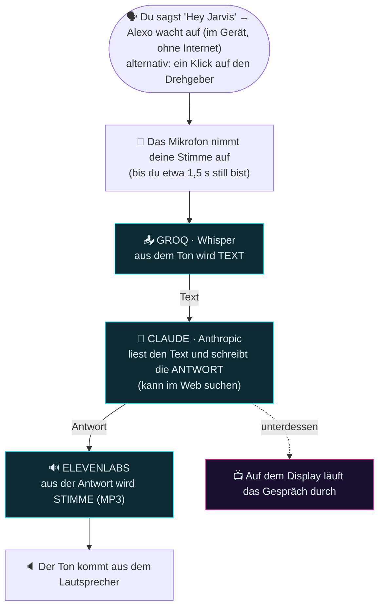
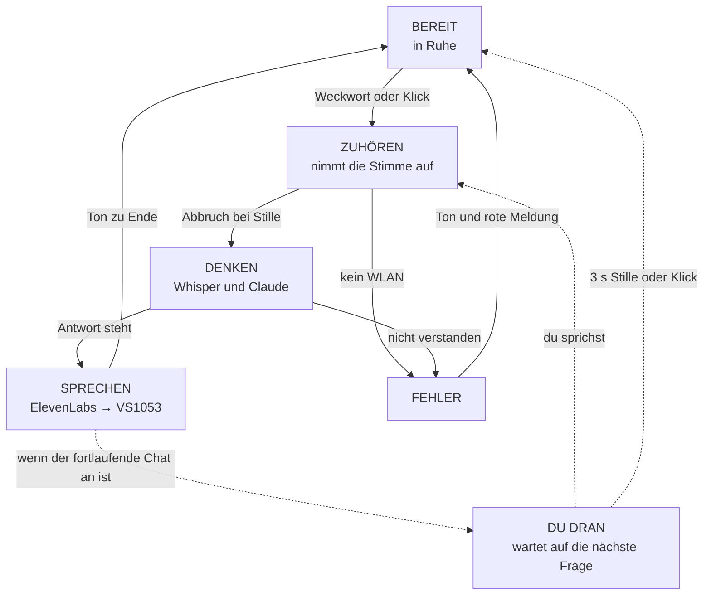
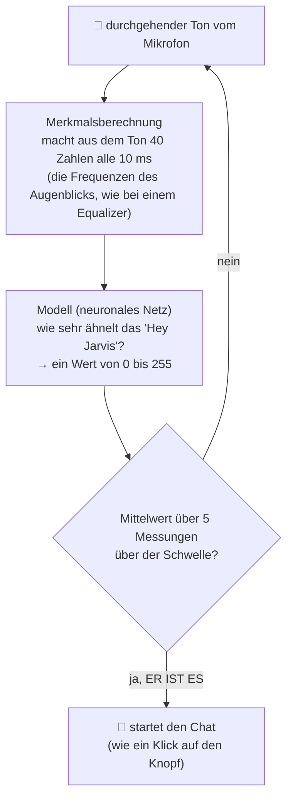

# HANDBUCH ZUM NACHBAUEN — ALEXO

**Ein Sprachassistent nach Art von Alexa, selbst gebaut auf dem ESP32-S3.**

Dieses Handbuch erklärt, **wie Alexo aufgebaut ist**, von der Seite der
**elektrischen Verbindungen** (was wohin gelötet wird und warum) ebenso wie von der
Seite des **Programms** (was jedes Stück Code tut). Es ist so geschrieben, dass man
es auch ohne Vorkenntnisse versteht: jeder schwierige Begriff wird mit einfachen
Worten und einem Beispiel erklärt.

> Dieses Handbuch erzählt auch das *Warum* hinter den Entscheidungen und nicht nur
> das *Wie*: wenn an deinem Aufbau etwas anders ist, weißt du so, wo du ansetzen
> musst.

> 🇩🇪 **Deutsche Fassung.** Dieses Repository ist ein Fork von
> [PeppeMinniti/alexo](https://github.com/PeppeMinniti/alexo). Texte und Verhalten
> sind übersetzt, Bezeichner im Code und Dateinamen sind italienisch geblieben.

---

## Inhalt

1. [Was Alexo ist und wie er "denkt"](#1-was-alexo-ist-und-wie-er-denkt)
2. [Die Sprachkette einfach erklärt](#2-die-sprachkette-einfach-erklärt)
3. [Die Bauteile und wozu sie dienen](#3-die-bauteile-und-wozu-sie-dienen)
4. [Die elektrischen Verbindungen, Stück für Stück](#4-die-elektrischen-verbindungen-stück-für-stück)
5. [Stromversorgung und die Fallen der Hardware](#5-stromversorgung-und-die-fallen-der-hardware)
6. [Die Software: wie sie aufgebaut ist](#6-die-software-wie-sie-aufgebaut-ist)
7. [Die wichtigsten Einstellungen (config.h und secrets.h)](#7-die-wichtigsten-einstellungen)
8. [Wie das Programm arbeitet, Modul für Modul](#8-wie-das-programm-arbeitet-modul-für-modul)
9. [Der Ablauf: das Leben einer Frage](#9-der-ablauf)
10. [Das Weckwort "Hey Jarvis" einfach erklärt](#10-das-weckwort-hey-jarvis-einfach-erklärt)
11. [Übersetzen und die Firmware aufspielen](#11-übersetzen-und-die-firmware-aufspielen)
12. [Fehlersuche und Behebung](#12-fehlersuche-und-behebung)
13. [Wie man Alexo anpasst](#13-wie-man-alexo-anpasst)
14. [Das Einstellungs-Panel im Browser](#14-das-einstellungs-panel-im-browser)
15. [Die Musik: Webradio hören](#15-die-musik-webradio-hören)
16. [Die KI zu Hause: alles auf dem eigenen PC](#16-die-ki-zu-hause-alles-auf-dem-eigenen-pc)

---

## 1. Was Alexo ist und wie er "denkt"

Alexo ist ein kleines Gerät, das **eine gesprochene Frage hört und gesprochen
antwortet**, wie Alexa oder Google Home. Der Unterschied ist, dass wir es selbst
gebaut haben, auf einem Mikrocontroller **ESP32-S3**.

Das eigentliche "Gehirn", also die künstliche Intelligenz, die versteht und
antwortet, **läuft nicht in Alexo**: es läuft in der Cloud. Alexo allein ist dafür
zu klein. Alexo spielt also den **Boten**: er nimmt deine Stimme auf, schickt sie
über das Internet an darauf spezialisierte Dienste, bekommt die Antwort zurück und
spricht sie aus.

**Ein Vergleich:** stell dir eine Telefonzentrale vor. Sie kennt die Antwort nicht
selbst, aber sie weiß, wen sie anrufen muss, um sie zu bekommen, und gibt sie dir
dann weiter. Alexo ist diese Zentrale.

Das Einzige, was Alexo **in sich selbst und ohne Internet** wirklich "klug" tut, ist
zu bemerken, wenn du das Zauberwort sagst ("Hey Jarvis"), um ihn zu wecken. Das
erledigt er allein.

> 🏠 **Die Cloud ist nicht zwingend.** Hast du zu Hause einen ausreichend kräftigen
> PC, kann jeder der drei Dienste (Spracherkennung, Gehirn, Stimme) **dort** laufen
> statt im Internet: Alexo ruft dann deinen PC im eigenen Netz an statt Groq,
> Anthropic und ElevenLabs. Am Gebrauch ändert das nichts, und es gibt einen
> Schalter, der ihm das Hinausgehen **verbietet**. Alles dazu steht in
> [Kapitel 16](#16-die-ki-zu-hause-alles-auf-dem-eigenen-pc). Im übrigen Handbuch
> wird der Einfachheit halber die Fassung mit der Cloud beschrieben.

---

## 2. Die Sprachkette einfach erklärt

Wenn du eine Frage stellst, durchläuft die Information eine **Kette** von Schritten.
Jeder Pfeil ist ein "Anruf" über das Internet (HTTPS):



Warum drei verschiedene Dienste und nicht einer?

- **Groq mit Whisper** ist sehr gut darin, **Stimme in Text** zu verwandeln (man
  nennt das Spracherkennung, englisch *Speech To Text*). Und es ist kostenlos.
- **Claude** ist das Gehirn: es liest den Text und schreibt die Antwort. Es ist gut
  darin, *zu verstehen und zu überlegen*, arbeitet aber nur mit Text und nicht mit
  Ton.
- **ElevenLabs** ist sehr gut darin, **Text in Stimme** zu verwandeln (die
  Sprachausgabe, englisch *Text To Speech*), mit einer natürlichen Stimme, die sich
  sogar der Stimme des Nutzers nachbilden lässt.

Jeder tut das, was er am besten kann. Alexo reiht sie aneinander.

> **Es braucht drei Schlüssel**: einen für Groq, einen für Anthropic (Claude) und
> einen für ElevenLabs. Sie sind so etwas wie persönliche Passwörter für diese
> Dienste. Man bekommt sie kostenlos beziehungsweise durch Anmeldung auf den
> jeweiligen Seiten. Wo sie hingehören, steht in
> [Kapitel 7](#7-die-wichtigsten-einstellungen).

---

## 3. Die Bauteile und wozu sie dienen

| Teil | Modell | Wozu es dient (einfach gesagt) |
| ---- | ------ | ------------------------------ |
| **Elektronisches Gehirn** | ESP32-S3 **N16R8** | Der Mikrocontroller. Er ist der "Rechner", der alles zusammenhält. Er hat WLAN eingebaut, 16 MB Flash-Speicher (dort liegt das Programm) und 8 MB PSRAM (Arbeitsspeicher, dort liegt der aufgenommene Ton). |
| **Mikrofon** | **ICS-43434** (I2S) | Das Ohr. Es ist ein *digitales* Mikrofon: es liefert bereits Zahlen und kein analoges Signal, das erst gedeutet werden müsste, und ist deshalb sauberer. |
| **Tondecoder** | **VS1003/VS1053** (SPI) | Die "Soundkarte". Sie nimmt einen MP3-Strom entgegen (die Stimme von ElevenLabs oder ein **Webradio**) und macht daraus echten Klang. Der ESP32 allein könnte kein MP3 abspielen. ⚠️ Sie decodiert **nur MP3** und kein AAC, was für die Radiosender zählt, siehe [Kapitel 15](#15-die-musik-webradio-hören). |
| **Verstärker** | **PAM8302A** | Er hebt das Signal des VS1053 so weit an, dass der Lautsprecher klingt. Der Decoder allein ist zu schwach. |
| **Lautsprecher** | irgendein kleiner | Der Mund. Er gibt den Klang aus. |
| **Display** | **ST7735** TFT 1,8 Zoll in Farbe | Der Bildschirm. Er zeigt den Chat, also deine Fragen und die Antworten, als durchlaufenden Teleprompter. |
| **LED-Ring** | **WS2812** mit 12 LED (NeoPixel) | Die "Zustandslichter". Sie wechseln die Animation, je nachdem, was Alexo gerade tut: zuhören, denken, sprechen. |
| **Knopf** | **Drehgeber** KY-040 | Die Bedienung. Ein Klick startet und beendet, Drehen blättert im Chat oder ändert die Lautstärke. |

> Ein Blick in die Geschichte: anfangs waren ein analoges Mikrofon **MAX4466** und
> eine eigene Taste verbaut. Der Code unterstützt das MAX4466 weiterhin, es genügt
> eine geänderte Einstellung, aber die heutige Fassung benutzt das digitale
> ICS-43434 und den Drehgeber als einzige Bedienung.

---

## 4. Die elektrischen Verbindungen, Stück für Stück

> ⚠️ **Die goldene Regel:** die Nummern der Anschlüsse des ESP32 legen wir in der
> Datei [`include/config.h`](include/config.h) fest. Diese Datei ist die **einzige
> maßgebliche Stelle**: verdrahtest du etwas um, änderst du *nur* dort etwas, und der
> Rest des Programms richtet sich von allein danach. Die Tabellen weiter unten geben
> die heutigen Werte aus `config.h` wieder.

Zuvor zwei Begriffe, die immer wiederkehren:

- **GPIO** steht für "General Purpose Input/Output", also die programmierbaren
  Beinchen des ESP32. Jedes hat eine Nummer (etwa GPIO14). Einige sind "besonders"
  und zu meiden, das erklären wir weiter unten.
- **Bus, sei es SPI oder I2S**, sind "Datenautobahnen". Mehrere Bauteile können sich
  dieselbe Autobahn teilen, es braucht aber jemanden, der sie steuert. Alexo benutzt
  mit Absicht **zwei getrennte SPI-Busse**, einen für den Ton und einen für das
  Display, damit sie sich nicht behindern.

### 4.1 Mikrofon ICS-43434 (am I2S-Bus)

Das digitale Mikrofon spricht die Sprache **I2S**: drei Signalleitungen und die
Versorgung.

| Anschluss am Mikrofon | Kommt an | Hinweis |
| --------------------- | -------- | ------- |
| VDD | **3V3** | Versorgung mit 3,3 V |
| GND | **GND** | Masse |
| SCK (Takt) | **GPIO5** | der "Taktgeber" |
| WS (Wortauswahl) | **GPIO6** | sagt, wann der linke und wann der rechte Kanal an der Reihe ist |
| SD (Daten) | **GPIO7** | hier laufen die Zahlen des Tons |
| L/R | **GND** | an Masse gelegt bedeutet, das Mikrofon nutzt den **linken** Kanal |

### 4.2 Tondecoder VS1053/VS1003 (am SPI-Bus für den Ton, genannt FSPI)

Das ist das heikelste Stück beim Verdrahten. Es teilt sich drei Leitungen (SCK,
MOSI, MISO), hat aber vier eigene Steuerleitungen.

| Anschluss am VS1053 | Kommt an | Wozu er dient |
| ------------------- | -------- | ------------- |
| SCK | **GPIO12** | der Takt des SPI-Busses |
| MOSI (SI) | **GPIO11** | Daten *zum* Baustein hin |
| MISO (SO) | **GPIO13** | Daten *vom* Baustein zurück |
| XCS | **GPIO10** | die Auswahl für **Befehle** |
| XDCS | **GPIO21** | die Auswahl für **Daten**, also den MP3-Strom |
| DREQ | **GPIO18** | der Baustein sagt "ich bin bereit, gib mir mehr Daten" |
| XRST | **GPIO8** | Reset über die Hardware |
| LOUT / ROUT / AGND | → Eingang des Verstärkers | der analoge Ton, der herauskommt |
| Versorgung | **5V** und GND | |

> **Warum liegt DREQ auf GPIO18 und XRST auf GPIO8 und nicht anderswo?** Anfangs
> lagen sie auf GPIO47 und GPIO38. An **GPIO38** hängt aber die eingebaute LED der
> Platine: deren Beschaltung "verschmutzte" das Reset-Signal beim Einschalten, und der
> Tonbaustein lief manchmal nicht an, der Start aus dem kalten Zustand war also
> unzuverlässig. Nach dem Verlegen auf GPIO8 war das Problem weg. Ein Beispiel dafür,
> wie sehr die Wahl der Anschlüsse zählt.

### 4.3 Verstärker PAM8302A

| Anschluss am PAM8302A | Kommt an | Hinweis |
| --------------------- | -------- | ------- |
| A+ / A− (Eingang) | **LOUT/ROUT und AGND des VS1053** | nimmt den schwachen Ton vom Decoder |
| VCC | **5V** | Versorgung |
| GND | **GND** | |
| SD (Abschaltung) | **GPIO39** | schaltet den Verstärker ein und aus (siehe unten) |
| Ausgang + / − | **Lautsprecher** | |

> **Der Kniff am Anschluss SD (GPIO39).** Ist der Verstärker an und kommt kein Ton,
> erzeugt er ein leises, störendes Rauschen. Deshalb bleibt er **bei Ruhe aus** und
> wird erst **einen Augenblick vor dem Sprechen eingeschaltet**. Der Anschluss SD ist
> LOW-aktiv: GPIO39 auf HIGH bedeutet Verstärker an, auf LOW bedeutet stumm, mit
> nahezu keinem Verbrauch und ohne Rauschen. Im Code erledigt das die Funktion
> `ampEnable()`.

### 4.4 TFT-Display ST7735 (am SPI-Bus für das Display, genannt HSPI — getrennt!)

| Anschluss am Display | Kommt an | Hinweis |
| -------------------- | -------- | ------- |
| SCLK (SCL) | **GPIO2** | Takt (ein vom Ton getrennter Bus) |
| MOSI (SDA/DIN) | **GPIO1** | Daten zum Display |
| CS | **GPIO42** | die Auswahl |
| DC (A0/RS) | **GPIO41** | "ist das ein Befehl oder ein Datum?" |
| RST (RES) | **GPIO40** | Reset |
| LED/BL (Hintergrundbeleuchtung) | **GPIO14** | schaltet das Licht des Bildschirms ein und aus |
| VCC | **3V3** | |
| GND | **GND** | |

> **Zwei schlaue Kleinigkeiten am Display:**
>
> 1. **Ein getrennter Bus (HSPI):** das Display hat eine eigene Autobahn, getrennt von
>    der für den Ton. So stockt der Ton nicht, während der Chat über den Bildschirm
>    läuft: das eine erledigt ein Kern des Prozessors, das andere der zweite. Zwei
>    Arbeiter, die einander nicht auf die Füße treten.
> 2. **Die Hintergrundbeleuchtung an GPIO14:** statt das Licht dauerhaft an zu lassen,
>    steuern wir es selbst. Nach zwei Minuten ohne Bedienung **schaltet** Alexo es zum
>    Stromsparen **ab** und beim ersten Eingriff wieder an. Der Anschluss zieht sehr
>    wenig (etwa 2 mA), wir verbinden ihn deshalb unmittelbar, ohne Transistor.

### 4.5 LED-Ring WS2812 (NeoPixel)

| Anschluss am Ring | Kommt an |
| ----------------- | -------- |
| DIN (Daten) | **GPIO48** |
| 5V | **5V** |
| GND | **GND** |

> **Vorsicht bei der Datenleitung (DIN):** ihre elektrischen Impulse können die
> benachbarten Leitungen "stören". Sie gehört **fern** von den Leitungen des Displays
> (SCLK und MOSI). Macht sie Ärger, also flackern LED während des Bildlaufs zufällig,
> hilft ein Widerstand von etwa 330 Ω in Reihe in der Datenleitung.

### 4.6 Drehgeber (der Knopf)

| Anschluss am Drehgeber | Kommt an | Hinweis |
| ---------------------- | -------- | ------- |
| CLK (A) | **GPIO16** | |
| DT (B) | **GPIO15** | |
| SW (Taste) | **GPIO17** | |
| + | **3V3** | |
| GND | **GND** | |

> Hinweis: sind nach dem Zusammenbau "im Uhrzeigersinn" und "dagegen" **vertauscht**
> (das passiert leicht, wenn die Leitungen A und B getauscht wurden), ist das kein
> Problem: man tauscht einfach die beiden Anschlüsse `CLK` und `DT` in `config.h`.

---

## 5. Stromversorgung und die Fallen der Hardware

### 5.1 Wie versorgt wird

Das System läuft an **5 V**, zum Beispiel aus einem USB-Netzteil. Mikrofon und
Display wollen **3,3 V**; Tondecoder, Verstärker und Ring wollen **5 V**. Beide
Spannungen kommen von der ESP32-Platine, die sowohl einen 3V3- als auch einen
5V-Anschluss hat, und die **Masse ist überall gemeinsam**.

> Versorgst du aus dem Anschluss **5V** der DevKitC-1, prüfe an deinem Modell, ob
> dieser Anschluss bereits mit der inneren Schiene verbunden ist oder ob auf der
> Platine eine Brücke "IN-OUT" zu schließen ist; bei manchen Nachbauten mit zwei
> USB-C-Buchsen ist 5V ab Werk getrennt.

### 5.2 Die Entkopplungskondensatoren (sehr wichtig!)

**Das Problem, das sich in der Praxis zeigte:** wenn die LED des Rings angehen,
ziehen sie den Strom ruckartig. Diese Rucke liefen über die Versorgung bis zum
Mikrofon und **verschmutzten** es mit Rauschen. Die Folge: die auf Geräusche
reagierenden Lichter spielten verrückt, und die Aufnahme war gestört.

**Die Lösung:** zwei **Kondensatoren** wirken wie ein "Wasserspeicher", der die Rucke
auffängt und die Spannung stabil hält:

- **470 µF** am VCC des Mikrofons
- **1000 µF** am 5V des LED-Rings

> Ein Vergleich: es ist, als stellte man einen Wasserbehälter neben einen Hahn, der
> ständig auf- und zugedreht wird. Der Behälter fängt die Stöße auf, und dahinter
> bleibt der Druck gleichmäßig.

### 5.3 Zwei weitere gelöste Fallen (gut zu wissen)

1. **Das Ausblenden der LED in Stufen.** Setzt man die Gesamthelligkeit der NeoPixel
   auf einen niedrigen Wert, *zerfallen* die Abstufungen: es bleiben nur wenige Stufen,
   und das Ausblenden wirkt ruckartig. Die Lösung: die Gesamthelligkeit auf dem
   **Höchstwert (255)** lassen und die niedrigen Werte **unmittelbar** in den Farben
   der Animationen verwenden.
2. **Der erste Ton, und danach Stille.** Der Decoder VS1053 verschluckt sich, wenn man
   ihm bei sehr kurzen Tönen den Befehl `stopSong()` schickt. Die Lösung: `stopSong()`
   nicht benutzen; stattdessen schickt man die Daten des Tons und danach etwas
   **Stille** (Bytes mit Wert null), die das letzte Stück hinausschiebt. Derselbe Kniff
   gilt für die Stimme und für die Signaltöne.

---

## 6. Die Software: wie sie aufgebaut ist

Das Programm ist in **C++** geschrieben, mit der Umgebung **PlatformIO** in VS Code.
Es ist in viele kleine Dateien geteilt, jede mit einer Aufgabe. Man nennt das
"Modularität": wie eine Küche, in der jeder Koch ein Gericht zubereitet.

```
include/               ← die "Etiketten" (Deklarationen) und die Einstellungen
  config.h             ← ★ ALLE Anschlüsse und Werte. Hier wird geändert.
  secrets.example.h    ← die Vorlage für Passwörter und Schlüssel (nach secrets.h kopieren)
  *.h                  ← je ein "Etikett" für jedes Modul unten

src/                   ← der eigentliche Code
  main.cpp             ← der DIRIGENT: er hält alles zusammen
  mic.cpp              ← nimmt vom Mikrofon auf
  net.cpp              ← verbindet sich mit dem WLAN
  stt.cpp              ← schickt den Ton an Groq und bekommt den Text
  llm.cpp              ← schickt den Text an Claude und bekommt die Antwort
  tts.cpp              ← schickt die Antwort an ElevenLabs und spielt die Stimme
  music.cpp            ← gibt das Webradio wieder (MP3-Strom an den VS1053)
  ui.cpp               ← belebt den LED-Ring
  gobbo.cpp            ← zeichnet den Chat auf das Display
  encoder.cpp          ← liest den Drehgeber
  volume.cpp           ← verwaltet die Lautstärke und merkt sie sich
  sound.cpp            ← erzeugt die Rückmeldetöne
  netlog.cpp           ← schickt das Protokoll über das Netz (lesbar ohne USB-Kabel)
  settings.cpp         ← Werte, die sich im Betrieb ändern lassen, gespeichert im NVS
  webui.cpp            ← der Webserver des Einstellungs-Panels
  wakeword.cpp         ← erkennt "Hey Jarvis" (die einzige KI, die auf dem ESP32 läuft)
  localai.cpp          ← die KI-Dienste zu Hause: antwortet der PC im Netz?

data/                  ← Dateien, die der Webserver ausliefert (über LittleFS)
  index.html           ← die Seite des Einstellungs-Panels

tools/                 ← Hilfswerkzeuge für die Entwicklung
  pruefe_sprache.py    ← sucht italienische Reste in den übersetzten Dateien
  test_cp437.py        ← prüft die Zeichentabelle des Displays
  test_wortgrenzen.py  ← prüft die Wortgrenzen der Absichtserkennung
  test_cp437.py        ← prüft die Zeichentabelle des Displays
```

**Zwei Kerne (zwei Gehirne im Prozessor).** Der ESP32-S3 hat zwei Rechenkerne. Alexo
teilt sie so auf:

- **Kern 1** führt die schwere Kette aus: aufnehmen und im Internet anrufen.
- **Kern 0** übernimmt die Animationen für LED und Display sowie das Lesen des
  Drehgebers.

Warum? Weil die Anrufe ins Internet denjenigen, der sie führt, für einige Sekunden
**blockieren**. Lägen die Animationen auf demselben Kern, würden sie einfrieren. Auf
einem eigenen Kern bleiben sie flüssig, auch während Alexo "denkt".

## 7. Die wichtigsten Einstellungen

### 7.1 `config.h` — die Anschlüsse und das Verhalten

Sie ist die Schaltzentrale. Einige Beispiele dafür, was sich dort einstellen lässt:

- Die **Nummern der Anschlüsse** jedes Bauteils (Kapitel 4).
- `MIC_USE_I2S` → `1` nimmt das digitale Mikrofon, `0` das alte analoge.
- `IDLE_REACTIVE` → `1` lässt die LED bei Ruhe zum Ton "tanzen".
- `REC_SILENCE_MS 1500` → nach 1,5 s Stille endet die Aufnahme von allein.
- `REC_MAX_MS 20000` → es wird nie länger als 20 Sekunden aufgenommen.
- `WAKE_ENABLE 1` → schaltet das Weckwort "Hey Jarvis" ein.
- `DISPLAY_SLEEP_MS 120000` → schaltet den Bildschirm nach zwei Minuten ohne
  Bedienung ab.
- Verschiedene Schalter zur **Fehlersuche** (`MIC_DIAG`, `WAKE_TEST`,
  `TFL_SELFTEST`), die wir in Kapitel 12 ansehen.

### 7.2 `secrets.h` — die Passwörter (NICHT weitergeben!)

Die Zugangsdaten fürs WLAN und die drei Schlüssel stehen in einer eigenen Datei,
`include/secrets.h`, die **nie ins Netz gelangt**, denn git schließt sie aus. Man
legt sie an, indem man die Vorlage kopiert:

```
include/secrets.example.h   →   kopieren und umbenennen nach   →   include/secrets.h
```

Und darin trägt man die echten Werte ein:

```cpp
#define WIFI_SSID        "der-name-deines-wlans"
#define WIFI_PASSWORD    "dein-passwort"
#define GROQ_API_KEY       "gsk_..."     // für Whisper (Stimme zu Text), kostenlos
#define ANTHROPIC_API_KEY  "sk-ant-..."  // für Claude (das Gehirn)
#define ELEVENLABS_API_KEY "sk_..."      // für die Stimme (Text zu Stimme)
```

> ⚠️ Die Schlüssel sind wie Passwörter: **nie** in öffentliche Dateien schreiben und
> nie weitergeben. Ist einer "verbrannt", erzeugt man auf der Seite des Dienstes einen
> neuen.

### 7.3 Die Einstellung gegen die Startschleife

In der Datei `platformio.ini` steckt eine Kleinigkeit, die **nicht angefasst werden
darf**. Die Platine N16R8 hat 16 MB Flash, das übliche Profil hält sie aber für eine
mit 8 MB. Ohne diese Zeilen gerät das Gerät in eine **Startschleife** und bootet
endlos neu:

```ini
board_upload.flash_size  = 16MB           ; sagt die Wahrheit über die Größe
board_upload.maximum_size = 16777216
board_build.arduino.memory_type = qio_opi ; schaltet die 8 MB PSRAM ein
```

Siehst du eines Tages nur noch seltsame Meldungen und ständige Neustarts auf der
seriellen Schnittstelle, ist das der erste Verdacht.

---

## 8. Wie das Programm arbeitet, Modul für Modul

### `mic.cpp` — das Ohr

Es nimmt den Ton vom Mikrofon mit **16000 Abtastwerten je Sekunde** auf, das ist die
"Auflösung", die Whisper haben will, und legt ihn ins PSRAM, den großen Speicher.

Kluge Dinge, die es tut:

- **Hochpass bei etwa 120 Hz:** ein Filter, der die tiefen Geräusche entfernt, also
  das Dröhnen und den Gleichanteil des Mikrofons, und die Stimme durchlässt. Das ist
  das Geheimnis der sauberen Aufnahme.
- **Selbsttätiger Abbruch bei Stille (nachgeführt):** während der Aufnahme misst es
  die mittlere Energie des Tons; hört es 1,5 s Stille, *nachdem* du gesprochen hast,
  beendet es von allein. So musst du nicht "Stopp" drücken. Die Schwelle, die Sprache
  von Stille trennt, ist **nicht fest**: sie berechnet sich über dem laufend
  geschätzten Grundrauschen (`Schwelle = Grundpegel × Faktor + Mindestabstand`) und
  passt sich damit von selbst an, wenn sich das Rauschen im Raum ändert. Sie arbeitet
  mit dem Mittelwert (RMS) und nicht mit dem Spitzenwert, denn stoßweise Geräusche
  wie ein Klopfen oder eine Windböe am Mikrofon erzeugen einzelne sehr hohe Spitzen,
  die den Spitzenwert täuschen würden, den Mittelwert aber nicht. Die beiden Werte
  (Faktor und Mindestabstand) lassen sich im
  [Web-Panel](#14-das-einstellungs-panel-im-browser) einstellen.
- **Der Pegel für die LED:** aus demselben Ton berechnet es, wie "laut" du sprichst,
  damit der Lichtring darauf reagiert. Dafür dient eine Hüllkurve, ein Wert, der
  langsam steigt und langsam fällt, damit die LED bei einzelnen Geräuschen nicht
  flackern.
- **"Habe ich echte Sprache gehört?"** Es merkt sich, ob der Ton während der Aufnahme
  wirklich die Schwelle überschritten hat (`micHeardVoice`). Das braucht die Abwehr
  gegen Geisterphrasen (siehe unten).

#### Der Filter gegen die Geisterphrasen von Whisper

Hin und wieder kommt es zu einem **ungewollten Start**, weil das Weckwort auf dem
Nachhall erneut auslöst oder eine Störung dazwischenfunkt: dann läuft eine Aufnahme,
die nur Stille oder Rauschen enthält. Die Spracherkennung (Whisper) vor der Stille
**"halluziniert"**: auf Deutsch erfindet sie fast immer Abspänne von Untertiteln wie
*"Untertitel der Amara.org-Community"* oder Höflichkeiten wie *"Vielen Dank"*. Die
Folge war, dass Alexo aus dem Nichts eine Antwort startete.

Zwei Vorkehrungen (in `main.cpp`):

1. **Wurde keine echte Sprache gehört**, kehrt Alexo zur Ruhe zurück, **ohne Whisper
   überhaupt zu fragen** (über `micHeardVoice`). Das schneidet das Problem an der
   Wurzel ab.
2. **Der Filter gegen Geisterphrasen:** ist die Transkription trotzdem *genau* eine
   bekannte Geisterphrase, wird sie stillschweigend verworfen. Die **Liste lässt sich
   im [Web-Panel](#14-das-einstellungs-panel-im-browser) bearbeiten**, du kannst also
   neue hinzufügen, ohne neu zu übersetzen.

> Bei der Übersetzung ins Deutsche wurde diese Liste **ersetzt und nicht übersetzt**:
> Whisper erfindet auf Deutsch andere Sätze als auf Italienisch. Zwei Fallen stecken
> darin: ein Komma trennt die Einträge, weshalb die Jahreszahl aus "... für funk,
> 2017" entfällt, und der Vergleich setzt nur ASCII-Buchstaben auf Kleinschreibung,
> weshalb Umlaute bereits klein in der Liste stehen müssen.

### `net.cpp` — das WLAN

Es verbindet sich mit dem Heimnetz und benutzt dafür die Zugangsdaten aus
`secrets.h`. Es braucht ein Netz mit **2,4 GHz**, denn der ESP32 spricht kein 5 GHz.

Es erledigt außerdem etwas Wesentliches für Zeitangaben: es **gleicht die Uhr über
NTP ab**, einen Dienst im Internet, der die genaue Zeit liefert, und setzt dabei die
deutsche Zeitzone samt selbsttätiger Sommerzeitumstellung. Von dort erzeugt
`nowContextString()` die Zeichenkette mit Datum und Uhrzeit (in Ortszeit und UTC),
die ins Gehirn wandert (`llm.cpp`). Ohne NTP startete der ESP32 im Jahr 1970, und
Claude wüsste nicht, wie spät es ist.

> Die Zeitzonenregel selbst blieb bei der Übersetzung unverändert: Europe/Berlin und
> Europe/Rome schalten zur selben Zeit um, nur die Beschriftung war anzupassen.

### `stt.cpp` — von der Stimme zum Text

Es nimmt den aufgenommenen Ton (im Format WAV), packt ihn in eine Webanfrage vom Typ
"multipart", so wie man eine Datei an ein Formular hängt, und schickt ihn an
**Groq**. Groq benutzt das Modell **Whisper** und gibt den Text dessen zurück, was du
gesagt hast. Alexo liest daraus das Feld `text`.

> Der Sprachcode, der mitgeschickt wird, steht auf `de`. Er verbessert die Erkennung
> spürbar, weil Whisper dann nicht raten muss, welche Sprache es hört.

### `llm.cpp` — das Gehirn (Claude)

Das "klügste" Stück. Es schickt deinen Text an die Schnittstelle von **Anthropic**
(ab Werk das Modell `claude-haiku-4-5`, schnell und günstig) und bekommt die Antwort.
Die wichtigsten Punkte:

- **Der System-Prompt:** eine "dauerhafte Anweisung" sagt Claude, dass es Jarvis
  ist und förmlich, knapp und mit ruhiger Höflichkeit antworten soll, den Nutzer
  mit "Sir" anredend (zwei bis drei Sätze, keine Aufzählungen und keine Emojis,
  denn es wird ja vorgelesen).
- **Das Gedächtnis des Gesprächs:** es behält die letzten acht Nachrichten, du kannst
  also nachfragen ("und in München?", nachdem du nach dem Wetter in Hamburg gefragt
  hast). Nach zwei Minuten ohne Bedienung wird es geleert und ein neues Gespräch
  beginnt.
- **Websuche:** Claude kann von sich aus im Internet nachsehen (Wetter, Nachrichten,
  Preise), bis zu dreimal je Frage. Alexo liest danach nur die Zusammenfassung vor.
- **Echtes Datum und echte Uhrzeit:** bei jeder Frage hängt Alexo Datum und Uhrzeit an
  den System-Prompt an, in Ortszeit und UTC, geholt von der über das Internet
  abgeglichenen Uhr (siehe `net.cpp`). Ohne das **weiß Claude nicht, wie spät es
  gerade ist**, und läge sowohl bei "wie spät ist es" als auch beim Umrechnen für
  andere Städte daneben, das es aus der UTC ableitet.

> Im System-Prompt steht seit dieser Übersetzung, dass auf Deutsch geantwortet wird
> und der Nutzer in Deutschland ist. Beides ändert die Antworten spürbar: die Sprache
> unmittelbar, der Ort bei Fragen nach Wetter, Zeiten und Preisen.

### `tts.cpp` — vom Text zur Stimme

Es schickt die Antwort an **ElevenLabs**, das eine **MP3**-Datei mit der Stimme
zurückgibt. Das MP3 kommt nicht auf einmal, sondern "stückweise" als Strom, und jedes
Stück geht sofort an den Decoder VS1053. So beginnt die Stimme, noch bevor alles
heruntergeladen ist, und es dauert nicht lange bis zum ersten Wort.

Es **bereitet den Text für die Aussprache auf** und wandelt die Zeichen und Formate
um, die die Stimme falsch läse. Beispiele: "36°C" wird zu "36 Grad Celsius", "19,5"
zu "19 Komma 5" und "100%" zu "100 Prozent". Auf dem Display bleibt alles normal
stehen, die Umwandlung gilt nur für die Stimme.

Dazu gehört auch das **Lesen von Uhrzeiten** (die Funktion `leggiOrario`): "12:30"
wird zu "12 Uhr 30", "00:00" zu "Mitternacht", "12:00" zu "Mittag", "14:00" zu
"14 Uhr" und "00:30" zu "null Uhr 30". Ohne das sagte die Stimme "zwölf Doppelpunkt
dreißig".

> Bei der Übersetzung sind rund 150 Zeilen entfallen, die Ordnungszahlen
> ausschrieben. Im Italienischen schrieb man "21° secolo" mit dem Gradzeichen, und es
> brauchte eine Unterscheidung anhand des folgenden Wortes. Im Deutschen steht das
> Gradzeichen immer für Grad, und "21." liest die Stimme selbst richtig.

### `music.cpp` — das Webradio

Es gibt ein **Radio über das Internet** wieder, einen durchgehenden MP3-Strom, und
benutzt dafür denselben Decoder VS1053 wie die Stimme. Du sagst *"spiel Musik jazz"*,
und Alexo öffnet den Strom und spielt ihn, bis du ihn anhältst.

Wie es kurz gefasst arbeitet:

- Der MP3-Strom kommt "stückweise" aus dem Netz und geht fortlaufend an den VS1053,
  wie die Stimme, nur ohne Ende. Möglich sind Ströme über **http und https**.
- Die Sender stehen in einer Liste, die sich im
  [Web-Panel](#14-das-einstellungs-panel-im-browser) **bearbeiten** lässt (Name,
  Wort zum Aufrufen und Adresse). Ausgewählt wird entweder durch das unmittelbare
  Erkennen des Wortes oder durch Claude mit einem eigens dafür gedachten Werkzeug,
  wenn du ein Genre nennst.
- Während es läuft, "tanzt" der LED-Ring zum Takt, denn das Mikrofon hört den
  Lautsprecher.
- ⚠️ **Nur MP3:** der VS1053 kann weder AAC noch HLS-Listen (`.m3u8`) decodieren,
  Formate, die viele Sender verwenden. Deshalb arbeiten nicht alle Sender; die
  Adressen müssen im Format MP3 vorliegen (siehe
  [Kapitel 15](#15-die-musik-webradio-hören)).

> Bei der Übersetzung wurden die Wörter deutsch, die den Musikwunsch erkennen (Musik,
> Radio, Lied, Song sowie spiel, leg auf, mach an, hör und will). Die **Schlüssel des
> Senderkatalogs sind noch italienisch** ("ottanta", "anni 80"), das steht als offener
> Punkt in der Spezifikation.

### `ui.cpp` — die Zustandslichter

Ein kleines Programm, das auf Kern 0 läuft und etwa 40-mal je Sekunde auf den
LED-Ring zeichnet. Zu jedem Zustand gehört eine Animation:

- **bereit (Ruhe):** die LED sind aus, oder sie "tanzen" zum Ton, wenn
  `IDLE_REACTIVE` gesetzt ist.
- **zuhören:** ein Balken, der sich mit der Lautstärke der Stimme von Grün nach Rot
  füllt.
- **denken:** ein umlaufender Komet in Violett und Cyan.
- **sprechen:** ein Pulsieren in Cyan.
- **Fehler:** rotes Blinken.
- **Aktualisierung über Funk:** ein grüner Komet.

> Alle Animationen rechnen mit der Zeit (`millis()`): sie bleiben flüssig, auch wenn
> einzelne Bilder ausfallen.

### `gobbo.cpp` — der Chat auf dem Display

"Gobbo" ist das italienische Fachwort für den **Teleprompter**. Der Modulname ist bei
der Übersetzung geblieben, damit ein Abgleich mit dem Originalprojekt möglich bleibt.
Es zeigt das Gespräch ("Du: …" in Gelb, "Alexo: …" in Weiß) und lässt es durchlaufen.
Die Kniffe:

- Es zeichnet alles zuerst in einen **Zwischenspeicher** und überträgt es dann in
  einem Zug auf den Bildschirm, so flimmert nichts.
- Während der Antwort **stimmt es den Bildlauf auf die Stimme ab**: die Zeile, die
  Alexo gerade "liest", bleibt ungefähr in der Mitte.
- Es wandelt Sonderzeichen in das Format der Displayschrift um. Bei der Übersetzung
  kamen **die Umlaute und das Eszett dazu**: die Zeichentabelle kannte nur
  italienische Akzente, und jedes deutsche Sonderzeichen wäre als Fragezeichen
  erschienen. Geprüft wird das von `tools/test_cp437.py`.
- Es **bedient auch den Drehgeber**, denn der liegt auf demselben Kern: Drehen
  blättert im Chat, ein Klick startet und beendet.
- **Die Anzeige während einer Aktualisierung:** bei einer Aktualisierung über WLAN
  erscheint eine eigene grüne Anzeigetafel mit dem **großen Prozentwert in der Mitte**
  und einem Fortschrittsbalken (`renderOtaScreen`). Gezeichnet wird sie von dieser
  Aufgabe, der einzigen, die den Bildschirm anfassen darf; der Code, der die
  Aktualisierung entgegennimmt, reicht ihr nur den Prozentwert.
- **Eine Kopie des Chats für das Web-Panel:** es hält zusätzlich eine schlanke Kopie
  der letzten 40 Nachrichten als sauberen Text bereit, die das
  [Web-Panel](#14-das-einstellungs-panel-im-browser) in seiner Karte "Chat" anzeigt.
  Ein Zähler meldet, wenn eine neue Nachricht eintrifft, damit der Browser den Chat
  **erst am Ende einer Nachricht** auffrischt und nicht ins Leere lädt.

### `encoder.cpp` — der Knopf

Es liest den Drehgeber mit einer eigenen Bibliothek und fragt ihn in einer eigens
dafür gedachten Aufgabe jede Millisekunde ab, damit keine Schritte verloren gehen. Es
kennt **vier Gesten**:

- **Klick** startet und beendet den Chat
- **Doppelklick** schaltet die auf Geräusche reagierenden LED ein und aus
- **gedrückt und gedreht** regelt die Lautstärke
- **Drehen** blättert im Chat

> Eine kleine, gelöste Schwierigkeit: die Bibliothek meldet auch beim ersten der
> beiden Klicks eines Doppelklicks einen "Klick". Um beide zu unterscheiden, wird der
> einfache Klick um **etwa 350 ms verzögert**: kommt in dieser Zeit ein zweiter Klick,
> war es ein doppelter, sonst ein einfacher.

> **Während das Radio läuft, ändern sich die Gesten** (wir sind dann im Zustand
> Musik): der **Klick** wechselt zum **nächsten Sender**, der **Doppelklick verlässt**
> das Radio und kehrt zum Chat zurück, und **Drehen** regelt, ob gedrückt oder nicht,
> die **Lautstärke**. So blättert man durch die Sender wie durch die Senderplätze
> eines Autoradios.

### `volume.cpp` — die Lautstärke, die sich merkt

Es regelt die Lautstärke des Decoders und **speichert sie dauerhaft im NVS**, sodass
sie einen Neustart übersteht. Die vom Knopf (Kern 0) gewünschte Änderung wendet Kern 1
auf sichere Weise an.

### `sound.cpp` — die Bestätigungstöne

Es erzeugt die Töne im Betrieb: einen hohen für "Aufnahme beginnt", einen tiefen für
"Stopp" und zwei tiefe für "Fehler". Es sind keine Dateien, sondern Sinusschwingungen,
die im Augenblick berechnet und an den Decoder gegeben werden.

### `netlog.cpp` — das Protokoll ohne Kabel lesen

Wenn kein USB-Kabel in Reichweite ist oder Alexo bereits fertig eingebaut steht,
lassen sich die Meldungen **über das Netz** lesen: dieses Modul schickt sie auch
dorthin. Man verbindet sich mit `telnet alexo.local` (Port 23) und liest sie von einem
anderen Rechner. Die Aktualisierung über Funk stört das nicht.

### `settings.cpp` — die Werte, die sich im Betrieb ändern lassen

Viele Werte (die Schwellen des Mikrofons, das Weckwort, die Lautstärke, die Stimme,
die Persönlichkeit von Claude) waren früher fest im Code "gemeißelt": um sie zu
ändern, musste man neu übersetzen. Heute leben sie in einer **Struktur im Speicher**
(`gSettings`), die beim Start **aus dem dauerhaften Speicher (NVS) geladen** wird; ist
dort nichts gespeichert, gelten die Werkseinstellungen aus `config.h`. Es sind genau
die Werte, die sich im [Web-Panel](#14-das-einstellungs-panel-im-browser) einstellen
lassen. "Werkseinstellung" setzt sie auf die Werte ab Werk zurück.

### `webui.cpp` — das Web-Panel

Ein kleiner **Webserver** (Port 80), der die Seite mit den Einstellungen ausliefert
(die Datei `data/index.html`, die über ein Dateisystem namens **LittleFS** im
Flash-Speicher liegt) und eine kleine Schnittstelle anbietet, um die Werte zu lesen
und zu speichern, die laufenden Mikrofonwerte abzufragen, die Musik anzuhalten und
**den Chat** im Browser zu zeigen. Siehe
[Kapitel 14](#14-das-einstellungs-panel-im-browser).

## 9. Der Ablauf

Das Herz von `main.cpp` ist ein **Ablauf mit festen Zuständen**: in jedem Augenblick
befindet sich Alexo in *einem* Zustand und geht zum nächsten über, sobald etwas
geschieht. Wie ein Brettspiel mit festen Feldern.



> In Ruhe (**BEREIT**) ist der Ring aus oder reagiert auf Geräusche.

Im Code führt die Funktion `runInteraction()` **einen** Wortwechsel von Anfang bis
Ende aus, und die Funktion `setState()` frischt **zugleich** die Lichter (`ui.cpp`)
und die Kopfleiste des Displays (`gobbo.cpp`) auf. Der Haupt-`loop()` startet nicht
nur bei Bedarf den Wortwechsel, sondern hält auch die Aktualisierung über Funk offen,
übernimmt Änderungen der Lautstärke und hört fortwährend auf das Weckwort.

### Der "fortlaufende Chat" (die gestrichelten Felder)

Gewöhnlich musst du nach der Antwort erneut "Hey Jarvis" sagen, um weiterzufragen. Ist
der **fortlaufende Chat** eingeschaltet (im Web-Panel, **ab Werk aus**), öffnet das
Mikrofon **von allein**: du fragst einfach das Nächste, wie in einem wirklichen
Gespräch. Im Code ist das `runConversation()`, das `runInteraction()` **in einer
Schleife** aufruft, solange es etwas zu sagen gibt; eine "Runde" ist eine gesprochene
Antwort.

Während er wartet, steht Alexo im Zustand **"du dran"**: auf dem Ring laufen **zwei
bernsteinfarbene Punkte mit gleichbleibender Helligkeit** um, und auf dem Display
steht "du dran". Es ist nicht der übliche Effekt, der der Stimme folgt, und das mit
Absicht: jener bedeutete "ich nehme dich bereits auf", und ein Effekt, der aus- und
wieder angeht, erweckte den Eindruck, der Chat schlösse und öffnete sich in jeder
Runde. Sobald du wirklich zu sprechen beginnst, wechselt er nach **ZUHÖREN**, und zwar
nach demselben Maßstab wie beim Abbruch bei Stille, also der Schwelle, die sich dem
Grundrauschen anpasst, und nicht nach einem festen Pegel.

Es endet auf **drei Wegen**, und es gibt keine Falle, in der man hängen bliebe:

1. **Du sprichst nicht** innerhalb von drei Sekunden → der Chat schließt sich und
   Alexo kehrt zur Ruhe zurück.
2. **Ein Klick auf den Drehgeber** → er schließt sofort (im Zustand "du dran" zählt der
   Klick wie beim Zuhören und beendet die leere Aufnahme).
3. **Irgendein Fehler** → er schließt.

> ⚠️ Eine Kleinigkeit, die nach Haarspalterei klingt und keine ist: bevor das Mikrofon
> wieder öffnet, **leert Alexo es 400 ms lang**. Der Nachhall der eben aus dem
> Lautsprecher gekommenen Stimme kommt ins Mikrofon zurück, und ohne dieses Aufräumen
> entstünde eine "Frage aus dem Nichts", die aus ihm selbst besteht.
>
> Das Gedächtnis des Gesprächs, also die letzten Wortwechsel, die an Claude gehen, gab
> es auch vorher schon: der fortlaufende Chat **nimmt nur das Weckwort weg** und fügt
> keinen Zusammenhang hinzu.

> Es gibt noch einen weiteren Zustand, **MUSIK**: fragst du nach einem Sender, geht
> Alexo hierhin und bleibt spielend, bis du ihn anhältst (Doppelklick oder über das
> Panel). In diesem Zustand bedient der Knopf das Radio (siehe
> [`encoder.cpp`](#encodercpp--der-knopf)) und nicht den Chat.

---

## 10. Das Weckwort "Hey Jarvis" einfach erklärt

Das ist die **einzige Intelligenz, die in Alexo selbst läuft**, ohne Internet. Sie
weckt ihn, wenn du das Zauberwort sagst, ohne dass du den Knopf anfassen musst.

**Wie kann er ein Wort "hören", ohne Sprache zu verstehen?** Er benutzt ein winziges
neuronales Netz, ein bereits trainiertes "Modell", das dank **TensorFlow Lite Micro**
läuft, einer Fassung der KI eigens für kleine Bausteine.

Der Weg, vereinfacht:



**Warum "Hey Jarvis" und nicht "Alexo"?** Weil es ein **fertiges Modell** ist, das man
herunterladen kann. Die Geschichte dahinter: bis zum 2. September 2026 lautete das
Wort **"Okay Nabu"**, und es wechselte aus einem praktischen Grund: dasselbe Wort kam
auch auf den Balancing Robot, und in einem Haus kann es nicht zwei Geräte wecken.
"Okay Nabu" blieb beim Roboter, der als einziger von beiden es bereits in der Praxis
erprobt hatte. Danach war es "Hey Mycroft".

Beim Umstellen dieses Forks auf Deutsch kam **"Hey Jarvis"** auf Wunsch des
Betreibers. Der ursprüngliche Autor hatte es verworfen, weil es ein englisches Modell
ist und bei italienischer Aussprache selten ansprach; auf Deutsch liegt der Klang
näher am Englischen, der Grund entfällt damit weitgehend. Bestätigen kann das nur der
Test am Gerät. "alexa" war ebenfalls versucht worden, löste aber bei jedem Wort mit
"-xa" darin aus. Ein **eigenes Wort** bleibt die Möglichkeit, die offen steht: dafür
muss ein neues Modell *trainiert* werden, was online mit Google Colab und künstlichen
Stimmen in etwa einer halben Stunde geht, und danach tauscht man die Modelldatei aus.

**Drei Lehren** (nützlich, wenn du daran arbeitest):

1. Das Modell arbeitet im *Strombetrieb*: es will einen **durchgehenden Fluss** an Ton
   ohne Pausen. Baust du Verzögerungen zwischen zwei Lesevorgängen ein, erkennt es
   nichts mehr.
2. **Zu viel Verstärkung übersteuert** und macht die Erkennung schlechter. Besser
   nicht übertreiben.
3. **Nach jedem Gespräch** muss der angesammelte Ton verworfen werden (`micFlush()`
   und `wakeReset()`), sonst weckt sich Alexo selbst, weil er seine eben gesprochene
   Antwort hört.

> Beim Wechsel des Modells ändern sich zwei Werte mit: die Schwelle und das
> Mittelungsfenster stehen im Manifest des Modells und sind keine Geschmacksfrage. Für
> "hey_jarvis" sind es 247 (aus 0,97) und 5. Einzelheiten in
> [WAKEWORD.md](WAKEWORD.md).

## 11. Übersetzen und die Firmware aufspielen

Das Projekt wird mit **PlatformIO** übersetzt. Die Befehle unten sind reines `pio`;
benutzt du PlatformIO in VS Code, findest du dieselben Schaltflächen (Build und
Upload) in der Oberfläche.

**Übersetzen** (aus den Quellen die Firmware bauen):

```
pio run -e esp32-s3-devkitc-1
```

### Das erste Aufspielen: über USB

Beim **ersten Mal**, also bei einer neuen Platine, wird **über das USB-Kabel**
aufgespielt: du verbindest den ESP32 mit dem Rechner und startest das Aufspielen über
die serielle Schnittstelle.

> ⚠️ In der `platformio.ini` dieses Repositorys sind am Ende die Zeilen für die
> **Aktualisierung über Funk** aktiv, denn so wird ein bereits eingebauter Alexo auf
> Stand gehalten. Für das erste Aufspielen über Kabel **tausche sie**: nimm das `;` vor
> den beiden Zeilen `upload_port = COMx` und `upload_protocol = esptool` weg (und trage
> deine serielle Schnittstelle ein) und setze es vor die beiden Zeilen mit
> `alexo.local` und `espota`.

```
pio run -e esp32-s3-devkitc-1 -t upload
```

> Unter Windows, wenn `pio` nicht im Suchpfad liegt, rufe es mit dem vollen Pfad auf.
> Schließe vor dem Aufspielen über USB einen etwaigen seriellen Monitor, sonst gilt
> die Schnittstelle als belegt ("Zugriff verweigert").

### Alle weiteren Male: über WLAN, wenn du magst

Sobald Alexo im WLAN ist, kannst du ihn **ohne Kabel** aktualisieren, "über die Luft".
Das ist bequem, wenn er bereits eingebaut steht oder schwer zu erreichen ist. In der
`platformio.ini` setzt man dafür die Zeilen für das Aufspielen über Funk nach
`alexo.local` (dem Netznamen von Alexo) anstelle derer für USB. Die Platine muss an,
im WLAN und in Ruhe sein.

Während der Aktualisierung erscheint auf dem Display eine **eigene Anzeige**: eine
grüne Anzeigetafel mit dem großen Prozentwert in der Mitte und dem Hinweis "NICHT
AUSSCHALTEN", damit du den Fortschritt auf einen Blick siehst.

> **Hast du die Seite des Web-Panels geändert** (`data/index.html`), musst du neben der
> Firmware auch das Dateisystem aufspielen, mit `... -t uploadfs`. Über Funk warte, bis
> `alexo.local` nach dem Neustart der Firmware wieder erreichbar ist, bevor du es
> startest. Siehe [Kapitel 14](#14-das-einstellungs-panel-im-browser).

> 💡 **Ein Rat: bewahre die `.bin`-Dateien auf, die funktionieren.** Jedes Mal, wenn
> eine Fassung am lebenden Gerät erprobt ist und läuft, lege die übersetzte Firmware
> beiseite (du findest sie in `.pio/build/esp32-s3-devkitc-1/` als `firmware.bin` und
> `littlefs.bin`). Geht ein Versuch schief, bist du in einer Minute zurück, ohne neu zu
> übersetzen. Zurückspielen lassen sie sich mit `espota.py` über Funk oder mit
> `esptool` über USB. Sichere die Kopie **erst nach** der Erprobung: eine ungeprüfte
> Fassung könnte genau den Rückschritt festhalten, gegen den du dich absichern
> wolltest.

---

## 12. Fehlersuche und Behebung

### 12.1 Lesen, was Alexo sagt

- **Über USB:** der serielle Monitor mit 115200 Baud an der Schnittstelle des ESP32.
- **Über WLAN** (ohne Kabel): `telnet alexo.local` (Port 23), siehe `netlog.cpp`.

### 12.2 Die Schalter zur Fehlersuche in `config.h`

Setzt du einen davon auf `1` und spielst die Firmware neu auf, geht Alexo in eine
besondere Betriebsart, die **den Chat nicht startet**, sich aber weiterhin
aktualisieren lässt. Zum Beenden setzt man ihn auf `0` und spielt erneut auf.

| Schalter | Was er tut |
| -------- | ---------- |
| `MIC_DIAG` | Misst das Rauschen des Mikrofons und gibt die Pegel aus: damit wählt man die richtige Verstärkung und erkennt, ob ein Rauschen "in der Software" liegt (tieffrequent, filterbar) oder "in der Hardware" (Masse oder Einstreuung). |
| `TFL_SELFTEST` | Zeigt, dass der KI-Motor (TensorFlow Lite Micro) arbeitet, anhand eines kleinen Testmodells. |
| `WAKE_TEST` | Prüft die Kette des Weckworts und gibt die "Wahrscheinlichkeit" aus, während du sprichst: nützlich, um die Schwelle abzustimmen. |

### 12.3 Typische Probleme und der erste Verdacht

| Was du beobachtest | Der erste Verdacht |
| ------------------ | ------------------ |
| Endlose Neustarts, nur Meldungen aus dem ROM | Die Einstellung gegen die Startschleife in `platformio.ini` (Kapitel 7.3) |
| PSRAM meldet 0 Byte | Es fehlt `memory_type = qio_opi` |
| Keine Verbindung ins WLAN | Ein Netz mit 5 GHz (es braucht 2,4 GHz) oder falsche Zugangsdaten in `secrets.h` |
| Es erscheint grundlos "Vielen Dank" oder ein Chat startet von selbst | Ein ungewollter Start samt Halluzination von Whisper auf Stille, inzwischen gefiltert: übersprungen, wenn keine Sprache zu hören war, dazu die Liste der Geisterphrasen im Panel |
| Die LED flackern bei Ruhe grundlos | Es fehlt der Hochpass oder die Entkopplungskondensatoren |
| Nur der erste Ton klingt | `stopSong()` wurde bei kurzen Tönen benutzt (Kapitel 5.3) |
| Der Tonbaustein läuft aus dem kalten Zustand nicht an | Der Reset (XRST) ist gestört, siehe die Wahl von GPIO8 (Kapitel 4.2) |
| Alexo weckt sich nach dem Sprechen selbst | Es fehlen `micFlush()` und `wakeReset()` am Ende des Wortwechsels |
| Auf dem Display stehen Fragezeichen statt Umlauten | Der Zeichentabelle in `gobbo.cpp` fehlt ein Eintrag; `python tools/test_cp437.py` sagt, welcher |

### 12.4 Die Methode: ändere eine Sache nach der anderen

Wenn etwas kaputtgeht, **ändere immer nur eine Sache** und prüfe nach. Fasse nicht
drei Werte gleichzeitig an: läuft es danach (oder eben nicht), weißt du nicht, woran
es lag. Das ist der schnellste Weg, den Schuldigen zu finden.

---

## 13. Wie man Alexo anpasst

> 💡 **Der bequemste Weg:** fast alles, was folgt, lässt sich inzwischen im
> [Web-Panel](#14-das-einstellungs-panel-im-browser) ändern (die Stimme, die zweite
> Stimme samt Auslöser, Modell und Persönlichkeit von Claude, die Schwellen für
> Mikrofon und Weckwort, die Lautstärke und die eigene Antwort), und zwar **ohne neu
> zu übersetzen**. Unten stehen die Stellen im Code für alle, die die *Werkswerte*
> ändern oder etwas anfassen wollen, das im Panel nicht auftaucht.

Alles ohne Eingriff in die Abläufe, nur ein paar Werte:

- **Die Stimme ändern (der Werkswert):** in
  [`include/config.h`](include/config.h) stehen `ELEVEN_VOICE_DEF`, die zweite Stimme
  `ELEVEN_VOICE_ALT_DEF` und das Auslösewort `VOICE_TRIGGER_DEF`. (Im Web-Panel
  änderst du die *gerade gültigen* Werte ohne neu zu übersetzen, und es dürfen mehrere
  Auslösewörter sein.) Ab Werk steht dort noch die Stimme aus dem Originalprojekt.
- **Alexo "klüger" machen (der Werkswert):** `LLM_MODEL_DEF` in `config.h`. Drei
  Möglichkeiten: `claude-haiku-4-5` (schnell und günstig), `claude-sonnet-5`
  (ausgewogen) und `claude-opus-5` (am klügsten, dafür langsamer und teurer). Im Panel
  wechselst du es im Betrieb. Für die Stimme zählt die Geschwindigkeit, also eher
  Haiku oder Sonnet.
- **Die Persönlichkeit ändern (der Werkswert):** `SYSTEM_PROMPT_DEF` in `config.h`
  oder im Panel. Es ist der Text, der beschreibt, wer Alexo ist und wie er antworten
  soll.
- **Zeiten und Schwellen der Aufnahme abstimmen:** `REC_SILENCE_MS`,
  `REC_SILENCE_MARGIN`, `REC_SILENCE_FLOOR` und `REC_MAX_MS` in `config.h`, die ersten
  drei auch im Panel.
- **Licht bei Ruhe an oder aus:** `IDLE_REACTIVE` in `config.h`, oder im Panel, oder
  per Doppelklick auf den Drehgeber.
- **Verhalten der reagierenden LED (die Werkswerte):** `MIC_LVL_MARGIN_DEF` und
  `MIC_LVL_FLOOR_DEF` für die Schwelle, `MIC_LVL_ATTACK_DEF` für den Anstieg und
  `MIC_LVL_RELEASE_DEF` für das Abklingen, alle in `config.h` und alle auch im Panel.
- **Die eigene Antwort:** `REPLY_TRIGGER_DEF` und `REPLY_TEXT_DEF` in `config.h` oder
  im Panel.
- **Das Weckwort wechseln:** man ersetzt die Modelldatei `src/wake_model.h` durch die
  eines anderen Wortes und zieht die Werte `WAKE_*` in `config.h` nach. Zum Trainieren
  eines eigenen Wortes siehe den Hinweis am Ende von
  [Kapitel 10](#10-das-weckwort-hey-jarvis-einfach-erklärt).
- **Die Liste der Geisterphrasen:** `HALLUC_TERMS_DEF` in `config.h` oder im Panel.
  Beachte dabei, dass ein Komma die Einträge trennt und Umlaute klein geschrieben
  gehören.

## 14. Das Einstellungs-Panel im Browser

Alexo hat eine **Schaltzentrale im Browser**: öffne `http://alexo.local/` von einem
Telefon oder Rechner im selben WLAN. Von dort stellst du die Werte ein, **ohne neu zu
übersetzen und ohne die Firmware aufzuspielen**: du änderst einen Wert, drückst
"Speichern", und er gilt sofort und dauerhaft, auch über einen Neustart hinweg.

### Wozu das gut ist (die eigentliche Erleichterung)

Früher war der Ablauf, um etwa die Empfindlichkeit gegenüber dem Grundrauschen
abzustimmen: *Code ändern, neu übersetzen, aufspielen, Telnet verbinden, ablesen*.
Heute ist es: *einen Regler am Telefon verschieben und die Wirkung in Echtzeit
ansehen*.

### Was sich einstellen lässt

- **Mikrofon, Abbruch bei Stille, LED:** nach wie vielen Millisekunden Stille die
  Aufnahme endet, der Faktor und der Mindestabstand der nachgeführten Schwelle (die
  Alexo unempfindlich gegen Grundrauschen machen), die Schwellen der reagierenden LED
  (Faktor und Mindestwert zum Einschalten), der **Anstieg** (wie schnell die LED
  angehen) und das **Abklingen** (wie schnell sie ausgehen) sowie das Ein- und
  Ausschalten des Lichteffekts bei Ruhe.
- **Weckwort "Hey Jarvis":** Verstärkung, Auslöseschwelle und das Mittelungsfenster,
  also wie "sicher" er sein muss, bevor er aufwacht.
- **Ton:** die Lautstärke; die voreingestellte **Stimme** (die ElevenLabs-Kennung);
  die **zweite Stimme** und ihre **Auslösewörter** (mehrere, durch Komma getrennt:
  beginnt der Satz mit einem davon, antwortet Alexo mit der anderen Stimme).
- **Gehirn:** das **Modell** von Claude (Haiku ist schnell, Opus am klügsten) und die
  **Persönlichkeit**, also der Text, der beschreibt, wer Alexo ist und wie er antworten
  soll.
- **Fortlaufender Chat:** nach einer Antwort öffnet sich das Mikrofon von allein, die
  nächste Frage braucht also nicht erneut "Hey Jarvis" (siehe
  [Kapitel 9](#9-der-ablauf)). Ab Werk aus; wirkt **beim Klick**, ohne Speichern.
- **KI zu Hause:** Adressen und Modellnamen der drei Dienste auf deinem PC, die
  **Temperatur** des Modells zu Hause und die beiden Schalter **"Nur zu Hause"** und
  **"Stimme immer zu Hause"**, dazu die Schaltfläche **"Jetzt prüfen"**. Alles erklärt
  in [Kapitel 16](#16-die-ki-zu-hause-alles-auf-dem-eigenen-pc).
- **Eigene Antwort:** ein **Auslöser** (Wort oder Satzteil) und ein **fester Text**:
  enthält die Frage den Auslöser, sagt Alexo diesen Text und **überspringt die KI**.
  Praktisch für feste Sprüche oder wiederholbare Videoaufnahmen; ein leerer Auslöser
  schaltet es ab.
- **Filter gegen Geisterphrasen (Whisper):** die Liste der **Geisterphrasen**, die
  verworfen werden (jene, die Whisper auf Stille erfindet); du ergänzt neue, wenn
  welche auftauchen. Leer lassen schaltet den Filter ab.
- **Musik (Webradio):** die **Senderliste**, ein Sender je Zeile im Format
  `Wort | Name | Adresse` (das *Wort* ist das, was du sagst, der *Name* erscheint auf
  dem Bildschirm, die *Adresse* ist der MP3-Strom). Dazu gibt es eine Schaltfläche
  **"⏹ Musik anhalten"** und die Anzeige, ob etwas läuft. Wie man passende Adressen
  findet, steht in [Kapitel 15](#15-die-musik-webradio-hören).

### Die laufenden Mikrofonwerte (das Beste daran)

Oben auf der Seite steht ein Feld, das jede Sekunde aufgefrischt wird und zeigt:

- den **Pegel** des Tons, den das Mikrofon gerade hört,
- das von Alexo geschätzte **Grundrauschen**,
- die **Schwelle** zum Einschalten (als Marke auf dem Balken),
- die **Wahrscheinlichkeit des Weckworts**, also wie sehr es "Hey Jarvis" ähnelt,
  während du sprichst,
- dazu WLAN und freien Speicher.

So stimmst du die Schwellen ab, indem du sie **sich bewegen siehst**: du bringst
etwa ein Grundrauschen hinein (Musik, Stimmengewirr, ein Haushaltsgerät), siehst, wo
sich der Pegel einpendelt, und setzt die Werte darunter. Der Messbetrieb `MIC_DIAG`
mit Telnet ist dafür nicht mehr nötig.

### Der Chat im Browser

Das Panel hat außerdem eine Karte **"Chat"**, die **dasselbe Gespräch zeigt, das über
das Display läuft** (deine Fragen und die Antworten von Alexo, die letzten 40
Nachrichten), aber über die volle Breite und bequem zum Lesen und Kopieren vom
Telefon. Sie frischt sich **bei jeder neuen Nachricht von allein auf**, nicht in
festen Abständen: ein kleiner Zähler meldet dem Browser nur dann etwas, wenn es Neues
gibt, sodass er nicht ins Leere lädt. Sie ist **nur zum Lesen** und dient dazu, das
Gespräch *nachzulesen*, nicht dazu, von dort zu schreiben. Nach einem Neustart ist
der Chat leer, wie auch der Verlauf auf dem Display, denn er wird nicht gespeichert.

### Wie es darunter arbeitet (einfach gesagt)

- Die Seite (`data/index.html`) ist eine Datei, die über **LittleFS** im Flash liegt.
  Der Webserver (`webui.cpp`) liefert sie an den Browser und beantwortet Anfragen
  einer Schnittstelle, um die Werte zu lesen und zu schreiben.
- Die Werte leben in `gSettings` (`settings.cpp`) und werden **im NVS gespeichert**,
  dem dauerhaften Speicher, sie überstehen also das Ausschalten.
- Der Server arbeitet synchron: während Alexo eine Frage bearbeitet, also aufnimmt
  oder mit dem Internet spricht, antwortet das Panel einige Sekunden lang nicht. Das
  ist normal, das Panel benutzt man, wenn Alexo ruht.

### ⚠️ Die Seite aktualisieren heißt zwei Schritte

Änderst du **nur den Code** (`.cpp` oder `.h`), genügt das übliche Aufspielen der
Firmware. Änderst du aber **die Seite** `data/index.html`, musst du *auch* das
Dateisystem aufspielen:

```
# 1) Firmware
pio run -e esp32-s3-devkitc-1 -t upload
# 2) die Seite (LittleFS)
pio run -e esp32-s3-devkitc-1 -t uploadfs
```

> Hinweis: spielst du über WLAN auf, startet das Gerät nach Schritt 1 neu; warte, bis
> `alexo.local` wieder erreichbar ist, bevor du Schritt 2 startest.

---

## 15. Die Musik: Webradio hören

Neben dem Beantworten von Fragen kann Alexo auch **Radio über das Internet**: du
fragst nach einem Sender oder einem Genre, und er spielt ihn über den Lautsprecher.

### Wie man es benutzt

- **Per Sprache:** *"spiel Musik jazz"*, *"spiel Radio"*. Sagst du ein Wort, das in
  der Senderliste steht, startet dieser Sender; fragst du allgemein nach einem Genre,
  wählt **Claude** einen passenden aus.
- **Während es läuft, mit dem Knopf:**
  - **Klick** → der **nächste Sender** (du blätterst durch die Sender wie durch die
    Senderplätze eines Autoradios)
  - **Doppelklick** → **verlässt** das Radio und kehrt zum Chat zurück
  - **Drehen** → die **Lautstärke** (bei null schaltet sich der Verstärker ganz ab, es
    rauscht also nichts)
- **Im Web-Panel:** die Schaltfläche **"⏹ Musik anhalten"**.

### Die Sender (und wie man welche hinzufügt)

Die Liste ändert man im [Web-Panel](#14-das-einstellungs-panel-im-browser), ein Sender
je Zeile:

```
virgin | Virgin Radio | http://icecast.unitedradio.it/Virgin.mp3
jazz   | Jazz          | http://listen.181fm.com/181-classicaljazz_128k.mp3
```

Das Format ist `Wort | Name | Adresse`. Das *Wort* ist das, was du aussprichst, der
*Name* erscheint auf dem Bildschirm, und die *Adresse* ist der Strom des Senders.

> Nach der Übersetzung ins Deutsche erkennt Alexo den Musikwunsch auf Deutsch, die
> **Schlüsselwörter der mitgelieferten Liste sind aber noch italienisch** ("ottanta",
> "anni 80"). Eigene Zeilen kannst du natürlich auf Deutsch anlegen.

### ⚠️ Die goldene Regel: nur MP3-Adressen

Der Decoder VS1053 kann **nur MP3** abspielen. Viele Sender senden aber in **AAC**
oder als **HLS-Liste** (`.m3u8`): die **arbeiten nicht**, auch wenn die Adresse
richtig aussieht. Das ist der Grund, warum manche bekannten Sender ausscheiden. Es ist
kein Mangel an Alexo, es ist das falsche Format. Suchst du eine neue Adresse, prüfe,
dass es ein unmittelbarer **MP3**-Strom ist.

### Warum manche Sender "kratzen" (ehrlich gesagt)

Es kann vorkommen, dass ein Sender, obwohl er MP3 liefert und auch startet, **stockend**
klingt, während ein anderer mit demselben Format glatt läuft. In diesem Fall liegt es
**nicht an Alexo**, sondern daran, **wie jener Server die Daten** über das WLAN
ausliefert. Manche Server schieben ein Polster an Daten voraus und halten das gut
durch, andere schicken nur das Nötigste in Echtzeit, und beim kleinsten Stolpern des
WLANs hört man es stocken. Praktisch hilft nur, **in der Liste die Sender zu behalten,
die in deinem Netz gut klingen** (das Protokoll über Telnet zeigt Name und Bitrate
jedes Senders, das hilft beim Ausprobieren).

> **Was NICHT geht:** Spotify, Amazon Music und Apple Music sind **nicht** erreichbar,
> sie verwenden geschlossene Protokolle und Kopierschutz. Und "spiel das Lied X von Y"
> auf Zuruf geht auch nicht: Webradios senden ein Programm und keine einzelnen Titel
> auf Bestellung.

---

## 16. Die KI zu Hause: alles auf dem eigenen PC

Bis hierhin war Alexo der **Bote ins Internet**. Aber ein Bote weiß nicht (und es
kümmert ihn nicht), *wo* der Dienst sitzt, den er anruft: ihm genügt, dass er richtig
antwortet. Daraus folgt die Idee: hast du zu Hause einen PC, auf dem die KI läuft,
**wird die anzurufende Nummer die deines PC**.

Das geht für **alle drei** Glieder der Kette, jedes unabhängig vom anderen:

| Glied | In der Cloud | Zu Hause (Beispiele) |
| --- | --- | --- |
| Spracherkennung (Stimme zu Text) | Groq Whisper | ein Whisper-Server, etwa faster-whisper |
| Gehirn (die Antwort) | Claude von Anthropic | LM Studio, Ollama, llama.cpp … |
| Stimme (Text zu Klang) | ElevenLabs | ein Server für Sprachausgabe, etwa Kokoro |

Du kannst auch **nur eines** zu Hause laufen lassen und die anderen beiden in der
Cloud belassen.

### Die Bedingung: dieselbe Sprache sprechen

Der Server auf dem PC muss seine Funktionen im **OpenAI-Format** anbieten, also auf
diese drei Adressen antworten. Das ist der Standard, den inzwischen fast alle
Programme für KI zu Hause verwenden, deshalb passt es:

```
POST <Adresse>/audio/transcriptions   ← Spracherkennung
POST <Adresse>/chat/completions       ← Gehirn
POST <Adresse>/audio/speech           ← Stimme
```

Im Web-Panel (die Karte **"KI zu Hause"**) trägst du für jedes der drei die **Adresse
bis `/v1`** ein (etwa `http://192.168.1.50:1234/v1`) und, wenn du magst, den Namen des
Modells. Den Rest hängt Alexo an.

> 💡 Nimm die **Zahlenadresse** des PC und nicht seinen Netznamen: das ist schneller
> und hängt nicht von der Namensauflösung ab. Und der Server muss **im ganzen Heimnetz**
> erreichbar sein (oft schreibt man dafür `0.0.0.0`) und nicht nur auf `localhost`:
> hört er nur auf sich selbst, sieht Alexo ihn nicht, und es wirkt, als sei etwas
> kaputt.
>
> Ein **leer gelassener Modellname** bedeutet "nimm das, was der Server gerade geladen
> hat" (Alexo fragt ihn mit `GET <Adresse>/models`): so wechselst du das Modell am PC,
> ohne im Panel etwas anzufassen.

### Die eine Regel

- **Leere Adresse** → der Dienst zu Hause ist aus, es geht wie immer in die Cloud.
- **Adresse eingetragen und der PC antwortet** → der PC wird benutzt.
- **Adresse eingetragen, aber der PC ist aus oder meldet einen Fehler** → es geht **von
  allein zurück in die Cloud**, ohne dass du etwas tun musst.

Die Prüfung "antwortet der PC?" hat mit Absicht eine **sehr kurze** Wartezeit: bei
ausgeschaltetem PC darf die Sprachkette nicht hängen bleiben. Das Ergebnis bleibt
einige Sekunden gespeichert, es lässt sich also bei jeder Frage abfragen, ohne jedes
Mal zu kosten.

### Die drei Punkte auf dem Display

Oben auf dem TFT stehen **drei Punkte**, in dieser Reihenfolge: **Spracherkennung,
Gehirn, Stimme**. **Grün** heißt, dieser Dienst zu Hause antwortet, **rot** heißt, es
wird die Cloud benutzt. Das Display läuft auf dem anderen Kern und kann nicht auf das
Netz warten, es zeigt deshalb das **zuletzt bekannte Ergebnis**. Aktuell hält es der
`loop()`, der, während Alexo ruht, **einen Dienst nach dem anderen etwa alle 20
Sekunden** erneut prüft.

### Die beiden Schalter (und wozu sie da sind)

Das selbsttätige Ausweichen in die Cloud ist bequem, aber **still**: du glaubst, zu
Hause zu sein, und deine Stimme ist soeben ins Internet gegangen. Die grünen Punkte
widerlegen das nicht, denn sie sagen, wie die letzte *Prüfung* ausging, und nicht,
wohin der eben gesprochene Satz ging. Daher zwei Schalter im Panel (beide **ab Werk
aus**, und beide wirken **beim Klick**, ohne Speichern):

- **"Nur zu Hause"** — Spracherkennung, Gehirn und Stimme gehen **nie** ins Internet.
  Fehlt der Dienst zu Hause oder macht er einen Fehler, **schreibt Alexo es in den Chat
  und hört auf**, statt heimlich auszuweichen. ⚠️ Ohne gültige Adressen zu Hause
  antwortet Alexo damit gar nicht mehr. Ausgenommen bleiben das **Webradio** (das
  forderst du selbst an) und die **NTP-Uhr** (sie trägt nichts von dem, was du sagst).
- **"Stimme immer zu Hause"** — dasselbe, aber auf die **Stimme allein** beschränkt.
  Das ist nützlich, weil ElevenLabs als einziger der drei nach Verbrauch abgerechnet
  wird. Die Stimme wird immer beim Server zu Hause angefordert, **ohne die vorherige
  Prüfung** (eine Wartezeit weniger) und **ohne Ausweichen**. Spracherkennung und
  Gehirn bleiben unberührt.

Ist "Nur zu Hause" gesetzt und geht ein Glied **doch** ins Internet, sagt Alexo es mit
einer Hinweiszeile im Chat (`[ins Internet gegangen: …]`): **grün auf dem TFT**, denn
Rot ist auf diesem Display unleserlich, und **rot im Web-Panel**. Ohne den Schalter
erscheint der Hinweis nicht: dort ist die Cloud der Normalbetrieb, und die Zeile wäre
bei jedem Satz nur Lärm.

> ⚠️ **Für die Stimme gilt die allgemeine Regel nicht.** Die Sprachausgabe zu Hause
> kommt **nur** zum Zug, wenn einer der beiden Schalter es verlangt, und nicht schon
> deshalb, weil der Server antwortet: eine eingetragene Adresse ohne gesetzten Schalter
> bedeutet ElevenLabs, ob der PC nun läuft oder nicht. Sonst genügte ein
> eingeschalteter PC, damit die Stimme wechselt, ohne dass jemand darum gebeten hätte.
> Spricht der Server zu Hause, steht vor der Antwort auf dem Bildschirm ein **`[LOC]`**;
> der vorgelesene Text bleibt unberührt.

### Was man wissen sollte, bevor man es versucht

- **Zu Hause gibt es keine Websuche.** Die Suche ist ein Werkzeug von Anthropic: beim
  Gehirn zu Hause existiert sie nicht, und der System-Prompt sagt ihm das ausdrücklich,
  sonst **erfindet** das Modell sie. Für Wetter, Nachrichten, Zeiten und Preise bleibt
  man besser in der Cloud.
- **Damit das Gehirn grün wird, genügt ein laufender Server nicht**: es braucht auch
  ein **geladenes Modell**. Ein leerer Server nimmt die Verbindung an und weist die
  Frage dann zurück, und du landest nach verlorenen Sekunden doch in der Cloud.
- **Die Temperatur des Modells zu Hause** lässt sich im Panel einstellen: die Server
  dort starten oft bei 0,7 bis 0,8, für einen Sprachassistenten zu hoch, dann schweift
  er ab. 0,2 bis 0,4 ergibt Antworten, die näher am Thema bleiben.
- **Das "Nachdenken" der Modelle, die überlegen** (der Block `<think>…</think>`),
  entfernt Alexo, auch wenn man das Modell bittet, nicht nachzudenken: nicht alle
  halten sich daran.
- **Die Stimme zu Hause wird als WAV angefordert**, nicht als MP3: der VS1053
  decodiert WAV unmittelbar, der Server muss also nichts komprimieren und es braucht
  kein `ffmpeg`. Das kostet mehr Bandbreite (etwa 380 gegenüber 128 kbit/s), was im
  WLAN nicht ins Gewicht fällt.
- **Das Gedächtnis des Gesprächs gibt es nur einmal** für beide Wege, es wird deshalb
  **beim Wechsel des Weges** und im Augenblick des Ausweichens **geleert**: was zu
  Hause gesagt wurde, geht nicht zusammen mit der nächsten Frage in die Cloud.
- **Die Verbindungen zu Hause laufen über einfaches `http://`**, ohne Verschlüsselung:
  sie bleiben im eigenen Netz und gehen nicht ins Internet.

### Prüfen, ob es arbeitet

Im Panel steht am Ende der Karte die Schaltfläche **"Jetzt prüfen"**: sie fragt die
drei Dienste, ob sie antworten und mit welchem Modell, und schreibt es darunter.
**Vorher speichern**: geprüft werden die Adressen, die bereits auf dem Gerät
gespeichert sind, und nicht die, die du gerade eintippst.

> **Was es ehrlicherweise kostet:** ein Modell, das auf einem PC zu Hause läuft, ist
> fast immer kleiner als die in der Cloud, es liegt bei Sprache und Allgemeinwissen
> also öfter daneben, und eine Websuche gibt es nicht. Dafür: keine Kosten nach
> Verbrauch, und was du sagst, verlässt das Haus nicht. Es ist ein Tausch und keine
> Verbesserung zum Nulltarif.

---

*Handbuch zum Projekt Alexo. Alle genannten Anschlüsse und Werte stehen in
[`include/config.h`](include/config.h), der einzigen maßgeblichen Stelle, an der
geändert wird.*

*Diese deutsche Fassung entstand aus dem Fork von
[PeppeMinniti/alexo](https://github.com/PeppeMinniti/alexo). Die offenen Punkte der
Übersetzung stehen am Ende von [CLAUDE.md](CLAUDE.md).*
