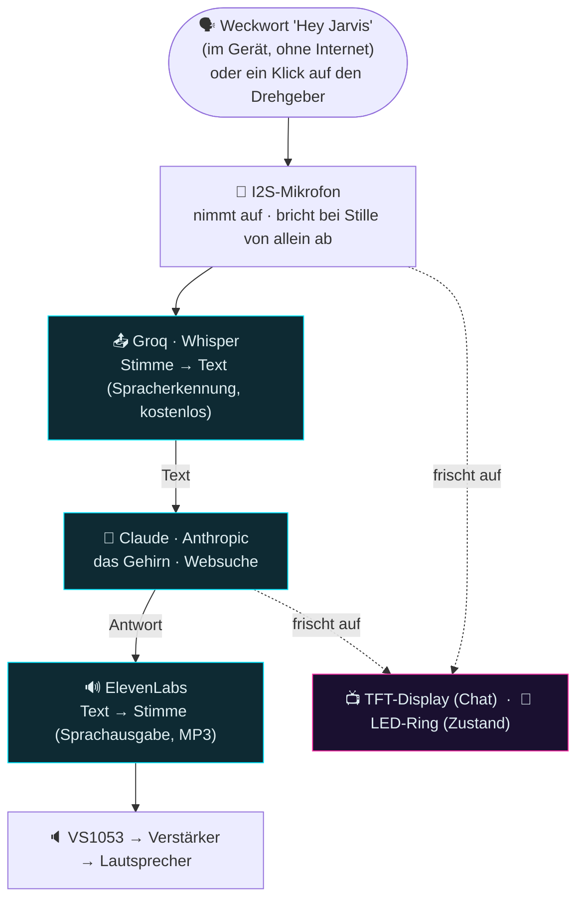

# Alexo — Sprachassistent zum Selberbauen auf dem ESP32-S3

Alexo ist ein Sprachassistent nach Art von Alexa oder Google Home, **von Grund auf
gebaut** auf einem **ESP32-S3**: er hört eine gesprochene Frage und antwortet
gesprochen, samt Chat auf dem Display und Lichtanimationen.

> 🇩🇪 **Deutsche Fassung.** Dieses Repository ist ein Fork von
> [PeppeMinniti/alexo](https://github.com/PeppeMinniti/alexo). Dokumentation,
> Kommentare, Oberfläche und das Verhalten des Geräts sind ins Deutsche übersetzt;
> der Assistent hört und antwortet auf Deutsch. Bezeichner im Code, Dateinamen und
> Ordnernamen sind absichtlich italienisch geblieben, damit ein Abgleich mit dem
> Originalprojekt möglich bleibt.

<p align="center">
  
</p>

> ⚠️ **Hobby- und Lernprojekt.** Zum Betrieb braucht es **drei eigene Schlüssel für
> die Dienste** (siehe unten). Ohne Gewähr, die Nutzung geschieht auf eigenes Risiko.

> 🖨️ **Das Gehäuse lässt sich in 3D drucken** — die Dateien (`.3mf` und STL) liegen auf
> **[MakerWorld](https://makerworld.com/it/models/3040023-alexo-ai-voice-assistant-case-esp32-s3)**
> (Lizenz CC BY 4.0).

---

## Wie es arbeitet

Alexo allein ist zu klein zum Denken: er ist der **Bote** zwischen einigen Diensten im
Internet. Das Einzige, was **im** ESP32 selbst rechnet, ist die Erkennung des
Weckworts.

> 🏠 Die Cloud ist allerdings nicht zwingend: jeder der drei Dienste lässt sich durch
> einen **Server im eigenen Netz** ersetzen (LM Studio, Whisper, eine Sprachausgabe) —
> siehe [Kapitel 16 des Handbuchs](MANUALE.md#16-die-ki-zu-hause-alles-auf-dem-eigenen-pc).



Auf dem TFT-Display läuft das Gespräch wie auf einem Teleprompter durch; der LED-Ring
wechselt die Animation je nach Zustand (zuhören, denken, sprechen).

## Was es kann

- 🗣️ **Weckwort im Gerät** "Hey Jarvis" (microWakeWord / TensorFlow Lite Micro, ohne Internet)
- 🎛️ **Drehgeber** als einzige Bedienung (Klick zum Sprechen, Drehen zum Blättern und für die Lautstärke)
- 🧠 **Gedächtnis für das Gespräch** und **Websuche** über Claude
- 💬 **Fortlaufender Chat** (abschaltbar): nach der Antwort öffnet das Mikrofon von
  allein, die nächste Frage braucht das Weckwort nicht erneut
- 🏠 **KI zu Hause** (abschaltbar): Spracherkennung, Gehirn und Stimme können auf einem
  **PC im eigenen Netz** laufen statt in der Cloud, mit einem Schalter "nie ins
  Internet gehen"
- ⏱️ **Abbruch bei Stille**, der sich dem Grundrauschen anpasst
- 📻 **Webradio** über MP3 (Sender per Sprache, Wechsel über den Drehgeber)
- 🌐 **Web-Panel** (`http://alexo.local/`): Parameter abstimmen, Lautstärke, Stimmen,
  Persönlichkeit von Claude und der **Chat in Echtzeit** — ohne neu zu übersetzen
- 🕒 **Echte Uhrzeit** über NTP, die das Gehirn mitbekommt
- ⬆️ **Aktualisierung über Funk** zusätzlich zum Weg über USB

## Hardware

| Bauteil        | Modell                                        | Aufgabe                          |
| -------------- | --------------------------------------------- | -------------------------------- |
| Mikrocontroller | ESP32-S3 **N16R8** (16 MB Flash, 8 MB PSRAM) | der "Rechner"                    |
| Mikrofon       | **ICS-43434** (I2S)                           | das Ohr                          |
| Tondecoder     | **VS1053 / VS1003** (SPI)                     | spielt MP3 ab (Stimme und Radio) |
| Verstärker     | **PAM8302A**                                  | treibt den Lautsprecher          |
| Display        | **ST7735** TFT 1,8 Zoll in Farbe              | Chat und Teleprompter            |
| LED-Ring       | **WS2812** mit 12 LED (NeoPixel)              | Animationen für den Zustand      |
| Bedienung      | Drehgeber **KY-040**                          | Klick und Drehen                 |

Der Anschlussplan Anschluss für Anschluss und die Hinweise zum Aufbau stehen im
[**MANUALE.md**](MANUALE.md) und in [CABLAGGIO_HW.md](CABLAGGIO_HW.md).

## Software

Die Firmware ist in **C++ mit PlatformIO** (Arduino) geschrieben und in Module geteilt:
`mic`, `net`, `stt`, `llm`, `tts`, `music`, `ui` (LED), `gobbo` (Display), `encoder`,
`volume`, `sound`, `wakeword`, `localai` (die KI-Dienste zu Hause), `settings` und
`webui` (das Panel). Die rechenintensive Kette läuft auf einem Kern, die Animationen
auf dem anderen, damit sie flüssig bleiben, auch während Alexo denkt.

## Wie man es baut (in Kürze)

1. **Klone** das Repository und öffne es mit [PlatformIO](https://platformio.org/) in
   VS Code.
2. **Lege deine Schlüssel an** (sie werden gebraucht):
   - **Groq** (Whisper, Spracherkennung) — kostenlos auf console.groq.com
   - **Anthropic** (Claude) — console.anthropic.com
   - **ElevenLabs** (Stimme) — elevenlabs.io
3. **Trage die Geheimnisse ein**: kopiere `include/secrets.example.h` nach
   `include/secrets.h` und setze WLAN und die drei Schlüssel ein. (`secrets.h` wird von
   git ignoriert und landet nicht im Repository.)
4. **Übersetzen und aufspielen** (das erste Mal über USB): am Ende von
   `platformio.ini` sind die Zeilen für die **Aktualisierung über Funk** aktiv. Für den
   Weg über das Kabel tausche sie gegen die beiden Zeilen `upload_port = COMx` und
   `upload_protocol = esptool` (siehe die Kommentare in der Datei).

   ```
   pio run -e esp32-s3-devkitc-1 -t upload
   ```

   **Einmal** muss auch die Seite des Web-Panels (der Ordner `data/`) ins Dateisystem
   des ESP. Das ist nur zu wiederholen, wenn du diese Seite später änderst:

   ```
   pio run -e esp32-s3-devkitc-1 -t uploadfs
   ```

5. Alle **Anschlüsse und Parameter** stehen in [`include/config.h`](include/config.h),
   der einzigen maßgeblichen Stelle.

Die vollständige Anleitung Schritt für Schritt, mit dem *Warum* hinter jeder
Entscheidung, steht im [**MANUALE.md**](MANUALE.md). Einzelheiten zum Weckwort in
[WAKEWORD.md](WAKEWORD.md).

## Dokumentation

- 📖 [MANUALE.md](MANUALE.md) — die vollständige Anleitung (Hardware und Software, einfach erklärt)
- 🔌 [CABLAGGIO_HW.md](CABLAGGIO_HW.md) — die Anschlüsse im Einzelnen
- 🧩 [WAKEWORD.md](WAKEWORD.md) — das Weckwort im Gerät im Detail
- 🖨️ [Gehäuse auf MakerWorld](https://makerworld.com/it/models/3040023-alexo-ai-voice-assistant-case-esp32-s3) — druckbare Dateien (`.3mf` und STL), Lizenz CC BY 4.0

---

## 👤 Autor

**Peppe Minniti** — *Automation Engineer* mit einem ungewöhnlichen Werdegang: kein
Ingenieurtitel, dafür viel Praxis. Er baut Systeme, die Hardware, Software und Mechanik
verbinden. Alexo ist eines seiner Projekte. Sein Motto: **"Lösungen, die
funktionieren".**

### 🆘 Steckst du bei deinem eigenen ESP32 fest?

**Wir lösen es gemeinsam, in Echtzeit.** Kostenlose Erstdiagnose, danach eine Sitzung zu
zweit mit geteiltem Bildschirm. → **[Zu ESP32 SOS ›](https://www.peppeminniti.it/assistenza_esp32/)**

<sub>Oder lerne, sie selbst zu bauen: [der vollständige Kurs "Dall'idea al sistema con ESP32"](https://www.peppeminniti.it/) · [Portfolio](https://www.peppeminniti.it/portfolio/) · [GitHub](https://github.com/PeppeMinniti) · [LinkedIn](https://www.linkedin.com/in/giuseppe-minniti-m2m-fablab)</sub>

## Lizenz

Veröffentlicht unter der **MIT**-Lizenz — siehe [LICENSE](LICENSE). Du darfst sie
benutzen, ändern und weitergeben, solange der Urhebervermerk erhalten bleibt.

## Dank

Idee, Entwurf, technische Entscheidungen, Erprobung und die Sorgfalt am Ergebnis stammen
von **Giuseppe Minniti**. Ein Teil der Entwicklung entstand zusammen mit einem
KI-Assistenten (Claude von Anthropic), der als Arbeitspartner diente: um Ideen
abzuwägen, Code zu schreiben und zu kommentieren und die Dokumentation auszuarbeiten.

Er versteht das als Zusammenarbeit, bei der beide Seiten wachsen: die KI ersetzt weder
die Arbeit noch die Entscheidungen von Menschen, sie begleitet und beschleunigt sie. Die
Richtung, das kritische Urteil und die Verantwortung für die Entscheidungen bleiben bei
dem, der entwirft — und gerade aus diesem Austausch entsteht die Gelegenheit, dazu zu
lernen, für beide Seiten.

Die deutsche Fassung dieses Forks entstand ebenfalls mit Claude.
